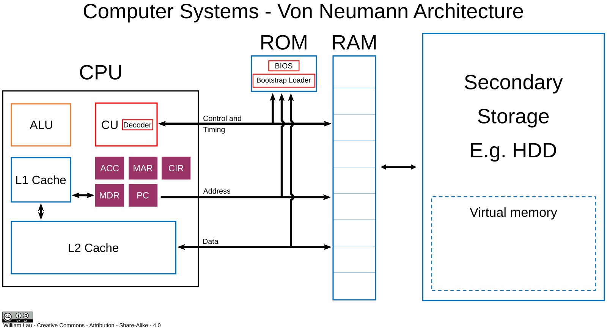

## Arquitectura

La **arquitectura de von Neumann** es un modelo de diseño para computadores propuesto por el matemático John von Neumann en 1945. Se ha convertido en la base de casi todos los sistemas informáticos modernos.

<!-- Local image stored in src/assets/ -->
<!-- Use a relative file path or import alias -->

### Componentes principales:
1. **Unidad Central de Procesamiento (CPU)**:
   - Compuesta por la **Unidad de Control** (que coordina las operaciones) y la **Unidad Aritmético-Lógica (ALU)** (que realiza cálculos matemáticos y operaciones lógicas).
   
2. **Memoria**:
   - Almacena tanto datos como instrucciones (programas) en el mismo espacio de memoria. Esto es lo que distingue la arquitectura de von Neumann de otras, como la Harvard, que separa las instrucciones y los datos.

3. **Dispositivos de Entrada y Salida (E/S)**:
   - Permiten la interacción del sistema con el exterior, facilitando la entrada de datos y la salida de resultados procesados.

4. **Bus de Datos**:
   - Un sistema de comunicación que transporta datos, direcciones y señales de control entre los diferentes componentes.

### Funcionamiento básico:
- **Ciclo de búsqueda y ejecución**: 
   1. La CPU busca una instrucción en la memoria.
   2. Decodifica la instrucción.
   3. Ejecuta la instrucción, ya sea realizando cálculos o moviendo datos.
   4. Repite el ciclo con la siguiente instrucción.

### Características clave:
- **Almacenamiento de programas**: En lugar de tener instrucciones fijas, los programas pueden ser modificados y almacenados junto con los datos en la memoria.
- **Secuencialidad**: Las instrucciones son ejecutadas una tras otra de manera secuencial, lo que permite controlarlas mediante un contador de programa.

### Ventajas:
- Simplicidad en el diseño y operación del sistema.
- Flexibilidad al permitir que el mismo hardware pueda ejecutar diferentes programas.

### Desventajas:
- **Cuello de botella de von Neumann**: Al compartir el mismo bus para acceder tanto a los datos como a las instrucciones, puede haber una limitación en el rendimiento, ya que la CPU puede quedar esperando mientras accede a la memoria. 
