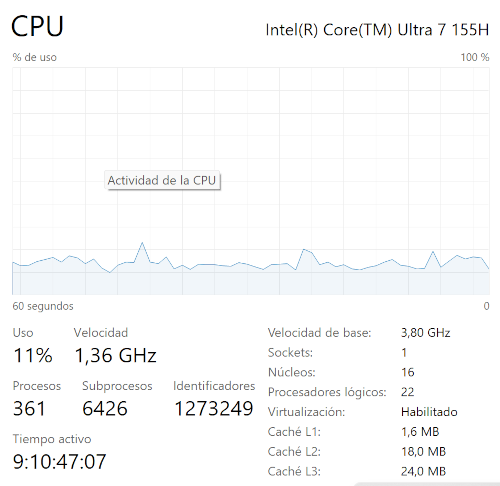
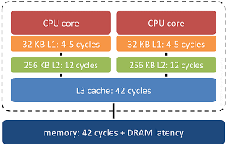
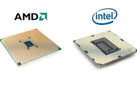

Al analizar un procesador (CPU), hay varios factores clave que debes tener en cuenta para comprender su rendimiento y cómo se adapta a tus necesidades. Aquí te resumo los aspectos más importantes que debes saber:

### 1. **Frecuencia de Reloj (Clock Speed)**
   - La frecuencia de los procesadores se mide en **gigahercios (GHz)**, que representan miles de millones de ciclos por segundo. Un procesador de **3.5 GHz**, por ejemplo, ejecuta **3,500 millones de ciclos cada segundo**.

   - Cuanto mayor es la frecuencia en GHz, más rápido puede ejecutar operaciones, aunque esto no siempre implica mayor rendimiento general (depende de otros factores como la arquitectura del procesador y la eficiencia energética).

Monitor CPU de Windows 11. (ctrl + mayusculas + esc)

### 2. **Número de Núcleos (Cores)**
   - Un núcleo es una unidad de procesamiento independiente dentro del procesador.
   - Cuantos más núcleos tenga un procesador, más tareas o hilos puede manejar simultáneamente. Procesadores con múltiples núcleos (dual-core, quad-core, octa-core, etc.) son mejores para multitarea y aplicaciones que requieren procesamiento paralelo.
   
   :::note
   Con el lanzamiento de los procesadores Intel Core de 12ª Generación (Alder Lake), Intel dio un gran paso adelante en esta filosofía, presentando dos tipos diferentes de núcleos dentro de un mismo procesador.

   - Los P-Cores se llaman así porque la P viene de Performance, rendimiento en inglés.
   - Los E-Cores se llaman así porque la E viene de Efficiency, eficiencia en inglés.
   - LP E-Core, que sería un núcleo de ultra-bajo consumo. Este diseño sería similar a los procesadores ARM, los cuales también tienen tres tipos de núcleos
   :::

### 3. **Número de Hilos (Threads)**
   - Los hilos son las unidades más pequeñas que gestionan las tareas dentro de un núcleo. Algunos procesadores tienen tecnología de **multithreading** (como **Hyper-Threading** de Intel) que permite a un núcleo manejar más de un hilo simultáneamente.
   - Más hilos permiten un mejor rendimiento en aplicaciones multitarea y tareas que se benefician del paralelismo, como edición de video o renderizado 3D.

:::danger[FYI]
Solo los P-core tienen hilos
:::

### 4. **Memoria Caché**
   - La caché es una memoria muy rápida integrada en la CPU para almacenar datos e instrucciones de uso frecuente.
   - **Tipos**: 
     - **L1**: Pequeña y ultrarrápida, cercana a los núcleos.
     - **L2**: Un poco más grande y más lenta que L1.
     - **L3**: Compartida entre todos los núcleos, más lenta pero de mayor capacidad.
   - La caché ayuda a acelerar el acceso a datos y reduce la necesidad de ir a la RAM para obtener información, mejorando el rendimiento general.

    

### 5. **Arquitectura del Procesador**
   - Se refiere al diseño y estructura interna del procesador. Las arquitecturas más comunes incluyen **x86** y **ARM**.
   - Las arquitecturas más modernas y eficientes (como **x86-64** o **ARMv8**) permiten un mejor rendimiento y menor consumo de energía.

### 6. **Proceso de Fabricación (Tecnología de fabricación)**
   - El tamaño de los transistores dentro de un chip, medido en **nanómetros (nm)**.
   - A menor tamaño de los transistores (por ejemplo, 7 nm o 5 nm), mayor densidad de transistores, lo que significa un procesador más eficiente y de mejor rendimiento. Esto reduce el consumo energético y genera menos calor.

### 7. **Potencia Térmica de Diseño (TDP - Thermal Design Power)**
   - Medida en vatios, indica la cantidad de calor que el procesador disipa bajo carga máxima.
   - Un TDP más alto implica mayor consumo de energía y la necesidad de mejores soluciones de refrigeración. Es relevante para saber qué tipo de sistema de refrigeración necesitarás.

### 8. **Soporte de Instrucciones**
   - Los procesadores modernos soportan conjuntos de instrucciones especiales como **SSE**, **AVX**, **NEON** (en ARM), que aceleran tareas específicas, como gráficos, cálculos científicos o cifrado.
   - Esto puede mejorar considerablemente el rendimiento en aplicaciones que aprovechan estas instrucciones.

### 9. **Compatibilidad con Memoria RAM**
   - Los procesadores están diseñados para trabajar con ciertos tipos y velocidades de memoria RAM (por ejemplo, **DDR4**, **DDR5**).
   - Cuanto más rápida y avanzada sea la memoria RAM que soporta, mejor será el rendimiento en tareas intensivas en memoria.

### 10. **GPU Integrada (iGPU)**
   - Algunos procesadores tienen una **Unidad de Procesamiento Gráfico** integrada, lo que permite gestionar gráficos sin necesidad de una tarjeta gráfica dedicada.
   - Para tareas ligeras como la navegación web, ofimática y reproducción de video, una GPU integrada puede ser suficiente, pero para tareas intensivas como gaming o renderizado, una GPU dedicada es preferible.

### 11. **Overclocking**
   - Algunos procesadores permiten **overclocking**, lo que significa que puedes aumentar manualmente su velocidad de reloj por encima de las especificaciones de fábrica.
   - Si eres un usuario avanzado que busca exprimir el máximo rendimiento, el overclocking puede ser una opción. Sin embargo, genera más calor y puede requerir refrigeración adicional.

### 12. **Fabricante (AMD vs Intel)**
   - Los dos principales fabricantes de procesadores para PCs de escritorio y portátiles son **Intel** y **AMD**.
   - AMD ha ganado terreno en los últimos años con sus procesadores Ryzen, que ofrecen una excelente relación calidad-precio, mientras que Intel sigue siendo competitivo con sus procesadores de alto rendimiento, especialmente en tareas de mononúcleo.

 

### 13. **Integración**
   - Desde la unión del North Bridge y South Bridge en lo que se conoce ahora el Chipset, el procesador ha integrado los controladores de Memoria Principal y PCI-express
   - Una evolución importante en la arquitectura de los sistemas informáticos que ha tenido un impacto significativo en el rendimiento y la eficiencia de los ordenadores modernos: **Reducción de la Latencia** y **Aumento del Ancho de Banda**

:::tip[Ampliación]
- [AMD and Intel processors naming](https://www.youtube.com/watch?v=ELJxau5qaQI)
- [Hiper Threading](https://www.youtube.com/watch?v=lrT9Bl0MCXQ)
:::