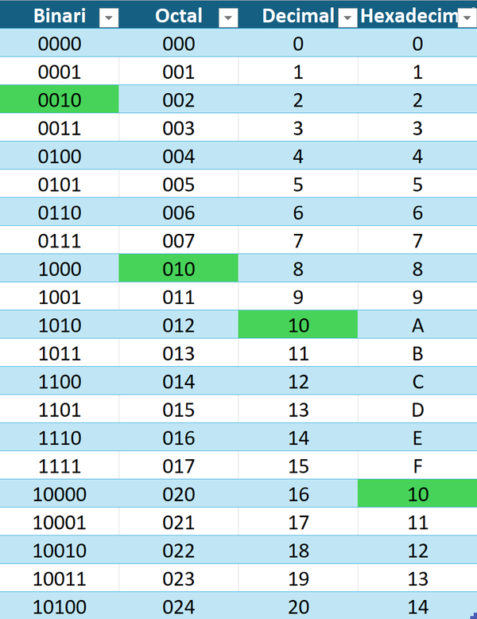
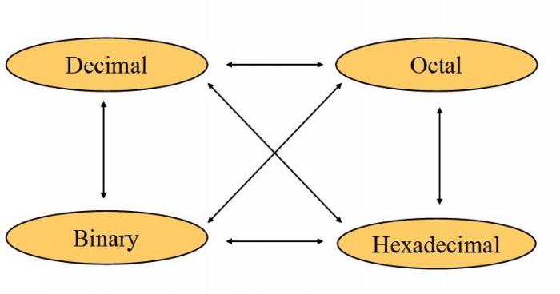

<!-- :::danger[PDF UT1]
[PDF UT1 - Botón derecho "descargar"](../../../../../public/ut1_es.pdf)
::: -->


:::note[Connection with the curriculum]
RA: 1 - CE: a, b, c, d
:::

## ¿Qué es la informática?
- La disciplina que estudia el tratamiento automático de la información.
:::tip
informática = **INFOR**mación auto**MÁTICA**
:::

## Partes de un Sistema Informático
- Parte física (hardware)
- Parte lógica (software) 
- Personal y usuarios
- Documentación

## Representación de la información

- El procesador(cerebro de la computadora) interpreta las instrucciones en binario (1s i 0s).

## Sistemas de representación
- Sistema binario (0,1)
- Sistema octal (0-7)
- Sistema decimal (0-9)
- Sistema hexadecimal (0-F) 



## Teorema fundamental de la numeración

$$
N = d_{n-1}\dots d_{1}d_{0}, d_{-1}\dots d_{-k}
$$
$$
= d_{n-1}\cdot 10^{n-1} + \dots + d_1\cdot 10^1 + d_0\cdot 10^0 + d_{-1}\cdot 10^{-1} + \dots + d_{-k}\cdot 10^{-k}
$$
$$
= \sum_{i=-k}^{n-1} d_i \cdot 10^i
$$

$$
3278=3\times 10^3+2\times 10^2+7\times 10^1+8\times 10^0 \\
3278=3\times 1000+2\times 100+7\times 10+8\times 1
$$



### Binario a Decimal
$$
\scriptsize 101010111_2=1\times2^8+0\times2^7+1\times2^6+0\times2^5+1\times2^4+0\times2^3+1\times2^2+1\times2^1+1\times2^0
$$
$$
\scriptsize 101010111_2=1\times256+0\times128+1\times64+0\times32+1\times16+0\times8+1\times4+1\times2+1\times1 = 343_{10}
$$

### Decimal a Binario
45 en decimal a binario

- 46 ÷ 2 = 23, r = 0 
- 23 ÷ 2 = 11, r = 1 
- 11 ÷ 2 = 5, r = 1 
- 5 ÷ 2 = 2, r = 1 
- 2 ÷ 2 = 1, r = 0 
- 1 ÷ 2 = 0, r = 1

R = 101110

### Binario a Octal (viceversa)

1274 octal a binario
```
1     2     7     4
001   010   111   100
```

1274 octal = 1010111100 binario

1010111100 a un sistema octal

```
001    010    111    100
1      2      7      4 
```

1010111100 binario = 1274 octal


### Binario a Hexadecimal (viceversa)

 **0010**1011**1100** binario = 2BC hexadecimal


### Hexadecimal a Octal (Intermedio)

$$
\begin{array}{ccc}
1 & F & 4 \\
0001 & 1111 & 0100
\end{array}
\qquad \rightarrow \quad 1F4_{16} = 111110100_2 \\
\textbf{111}110\textbf{100}_2 = 764_8
$$

### Hexadecimal/Octal a Decimal

Se realiza de la misma manera que se hace de [binario a decimal](#binario-a-decimal) mediante el TFN pero con base 8 o 16

#### Ejemplo de conversión de hexadecimal a decimal

Para convertir el número hexadecimal **3FA** a decimal:

1. **Valor de cada dígito**:
   - 3 = 3
   - F = 15
   - A = 10

2. **Multiplicación por la potencia de 16 según la posición**:
   - 3 × 16² = 768
   - 15 × 16¹ = 240
   - 10 × 16⁰ = 10

3. **Suma de resultados**:
   \[ 768 + 240 + 10 = 1018 \]

El número hexadecimal **3FA** es equivalente a **1018** en decimal.


#### Ejemplo de conversión de octal a decimal

Para convertir el número octal **745** a decimal:

1. **Valor de cada dígito**:
   - 7 = 7
   - 4 = 4
   - 5 = 5

2. **Multiplicación por la potencia de 8 según la posición**:
   - 7 × 8² = 448
   - 4 × 8¹ = 32
   - 5 × 8⁰ = 5

3. **Suma de resultados**:
   \[ 448 + 32 + 5 = 485 \]

El número octal **745** es equivalente a **485** en decimal.

:::tip
Binary Code Game
:::