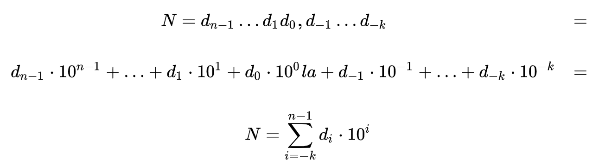
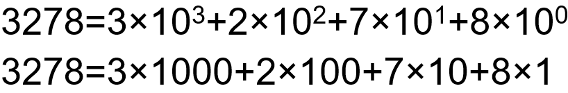
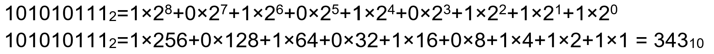
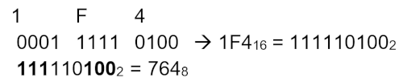

<!-- :::danger[PDF UT1]
[PDF UT1 - Botón derecho "descargar"](../../../../../public/ut1_es.pdf)
::: -->

:::note[Connection with the curriculum]
RA: 1 - CE: a, b, c, d
:::

## ¿Qué es la informática?
- La disciplina que estudia el tratamiento automático de la información.
:::tip
informática = **INFOR**mación auto**MÁTICA**
:::

## Partes de un Sistema Informático
- Parte física (hardware)
- Parte lógica (software) 
- Personal y usuarios
- Documentación

## Representación de la información

- El procesador(cerebro de la computadora) interpreta las instrucciones en binario (1s i 0s).

## Sistemas de representación
- Sistema binario (0,1)
- Sistema octal (0-7)
- Sistema decimal (0-9)
- Sistema hexadecimal (0-F) 

## Teorema fundamental de la numeración

### Binario a Decimal

### Decimal a Binario
45 en decimal a binario

- 46 ÷ 2 = 23, r = 0 
- 23 ÷ 2 = 11, r = 1 
- 11 ÷ 2 = 5, r = 1 
- 5 ÷ 2 = 2, r = 1 
- 2 ÷ 2 = 1, r = 0 
- 1 ÷ 2 = 0, r = 1

R = 101110

### Binario a Octal (viceversa)

1274 octal a binario
> 1--------2--------7--------4

> 001-----010-----111-----100 

1274 octal = 1010111100 binario

1010111100 a un sistema octal

> 001 010 111 100

> 1 2 7 4 

1010111100 binario = 1274 octal

### Binario a Hexadecimal (viceversa)

 **0010**1011**1100** binario = 2BC hexadecimal

### Hexadecimal a Octal (Intermedio)

### Hexadecimal/Octal a Decimal

Se realiza de la misma manera que se hace de [binario a decimal](#binario-a-decimal) mediante el TFN pero con base 8 o 16

#### Ejemplo de conversión de hexadecimal a decimal

Para convertir el número hexadecimal **3FA** a decimal:

1. **Valor de cada dígito**:
   - 3 = 3
   - F = 15
   - A = 10

2. **Multiplicación por la potencia de 16 según la posición**:
   - 3 × 16² = 768
   - 15 × 16¹ = 240
   - 10 × 16⁰ = 10

3. **Suma de resultados**:
   \[ 768 + 240 + 10 = 1018 \]

El número hexadecimal **3FA** es equivalente a **1018** en decimal.

#### Ejemplo de conversión de octal a decimal

Para convertir el número octal **745** a decimal:

1. **Valor de cada dígito**:
   - 7 = 7
   - 4 = 4
   - 5 = 5

2. **Multiplicación por la potencia de 8 según la posición**:
   - 7 × 8² = 448
   - 4 × 8¹ = 32
   - 5 × 8⁰ = 5

3. **Suma de resultados**:
   \[ 448 + 32 + 5 = 485 \]

El número octal **745** es equivalente a **485** en decimal.

:::tip
Binary Code Game
:::