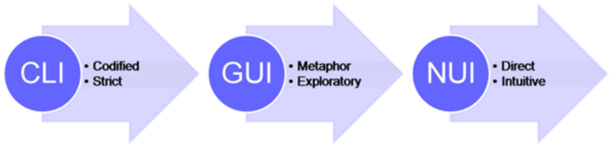

Las Interfaces de Línea de Comandos (CLI), también conocidas como interfaces basadas en texto o consolas, permiten a los usuarios interactuar con un sistema informático a través de comandos de texto. Estos comandos se introducen típicamente a través de una terminal o un símbolo del sistema.

Las interfaces CLI pueden parecer arcaicas en la era de las elegantes interfaces gráficas de usuario (GUI) y las emergentes tecnologías de interfaces naturales de usuario (NUI), pero siguen siendo herramientas indispensables para los usuarios avanzados y profesionales que buscan un control y una eficiencia incomparables.

Las interfaces CLI siguen siendo una herramienta fundamental en la informática, especialmente para tareas que requieren un control preciso y automatización.

## Pros y Contras de CLI
- **Pros:**
  - Bueno para hacer cosas repetitivas y automatizarlas.
  - No consume mucha potencia de la computadora.
  - Ofrece un control exacto sobre cómo se configura el sistema.
  - Necesario para servidores donde el acceso remoto es común y usar una GUI podría no funcionar bien.
- **Contras:**
  - Más difícil de aprender para los nuevos usuarios.
  - Hay que escribir comandos, lo que puede parecer más difícil que hacer clic en cosas.
  - No muestra tanta información en la pantalla como las GUI.
  - Los comandos pueden ser complejos a veces, lo que puede llevar a errores si no se escriben correctamente.

:::tip
[Manz.dev desarrollador que destaca el terminal](https://manz.dev)
:::