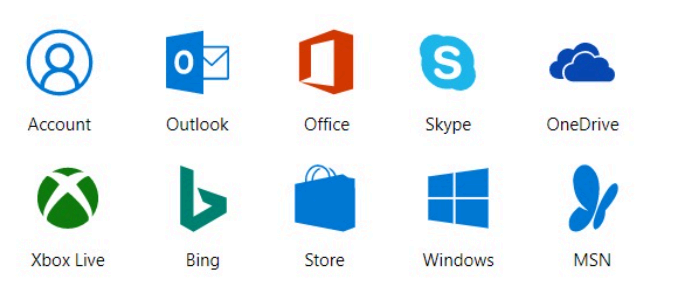
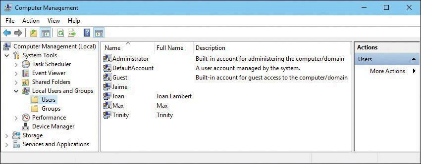
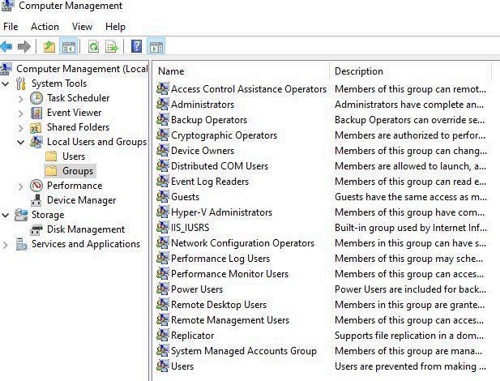
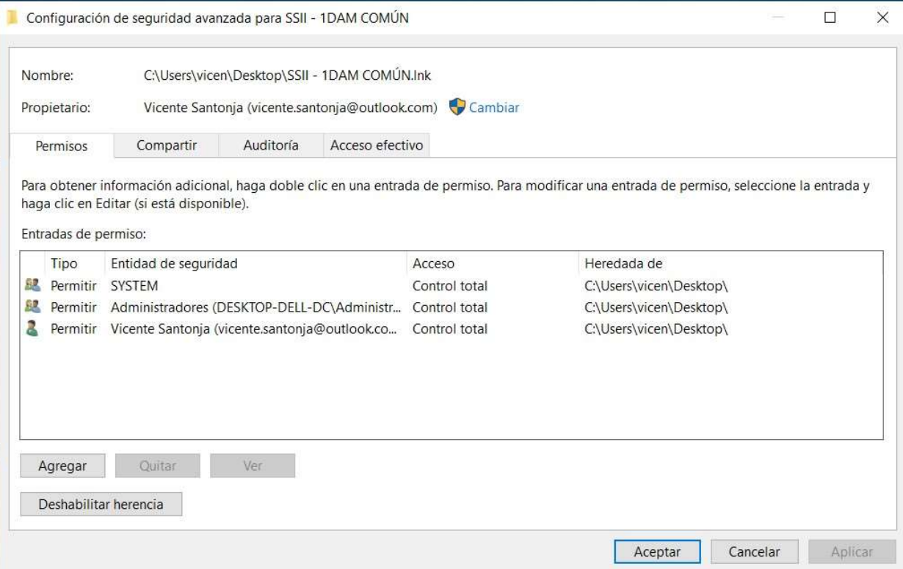

## 1. Usuarios, grupos y permisos en Windows

Antes de trabajar con un dispositivo con Windows 10, debes iniciar sesión con una **cuenta autorizada**. Las cuentas de usuario son esenciales para la seguridad de Windows y para ofrecer una experiencia personalizada.

### Tipos de cuentas en Windows 10

1. **Cuenta de Microsoft**  
   - Proporciona autenticación y sincronización entre dispositivos.
   - Se puede usar un correo de cualquier proveedor para crearla.

2. **Cuenta local**  
   - Credenciales y datos almacenados en el equipo.
   - No requiere un correo electrónico.

3. **Cuenta de Azure Active Directory**  
   - Para empresas y centros educativos.
   - Ofrece autenticación multifactor y acceso a servicios en línea.

4. **Cuenta de dominio de Active Directory**  
   - Para organizaciones con dominios Windows.
   - Requiere Windows 10 Pro, Enterprise o Education.

### Gestión de cuentas

- Usa **Configuración > Cuentas** para administrar cuentas.
- También puedes usar el **Panel de control clásico**.

### Cuentas locales predeterminadas
- **Administrador:** no se puede eliminar y está deshabilitada por defecto.
- **Invitado:** permite accesos temporales, pero está deshabilitada por defecto.

### Gestión de grupos locales

Un grupo es una colección de cuentas que puedes administrar como una unidad. Los grupos simplifican la administración de permisos en recursos.

### Grupos predeterminados en Windows 10
- **Administradores:** tienen control total sobre el sistema.
- **Usuarios:** cuentas estándar con acceso limitado.

Puedes gestionar los grupos locales desde la **Consola de administración de equipos**.

:::caution[actividad]
Gestión de usuarios y grupos
:::

## 2. Gestión de permisos de archivos y carpetas

Los permisos son esenciales para autorizar usuarios a acceder a recursos en un equipo. 

### Tipos de permisos
- **Explícitos:** configurados al crear un recurso o mediante acción del usuario.
- **Heredados:** propagados desde el contenedor del recurso.

### Otorgar y denegar permisos
- Los propietarios pueden conceder permisos a usuarios o grupos.
- Los permisos no concedidos explícitamente se deniegan implícitamente.

Evita el uso de denegaciones explícitas, ya que aumenta la complejidad y puede causar errores.

#### Opcions Avançades

:::caution[actividad]
Gestión de permisos de archivos y carpetas
:::