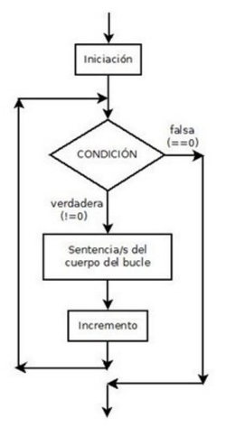

Un bucle **for** en bash es una estructura de control (de repetición) que permite ejecutar un conjunto de comandos repetidamente para cada elemento en una lista o un rango de valores.


```bash
#!/bin/bash
for (( inicialización; condición; incremento ))  
do
  instrucciones
done
```

### Ejemplo 1

```bash
#!/bin/bash
IFS=$'\n'
#calculo nº de lineas
lineas=`wc -l nombres | cut -d ' ' -f 1`
for ((x=1;x<=$lineas;x++))
do
  echo $x
  linea=`head -n$x nombres | tail -n 1` 
  nombre=`echo $linea | cut -d ' ' -f 1`
  adduser $nombre
  echo "$nombre añadido como usuario" 
done
```