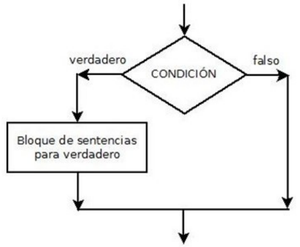
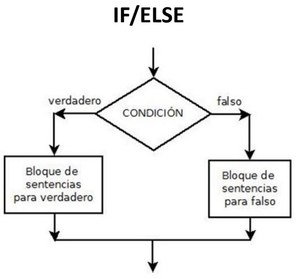

El **if** es una estructura condicional en programación que permite ejecutar un bloque de código solo si se cumple una condición específica.

```js
if [[ condición ]]
then
  acciones
fi
```

- **if** abre la estructura y **fi** la cierra
- [[ condición ]] 
  - verdadero → ejecuto “acciones” 
  - falso → no ejecuto nada

- [[ expresión ]] → Permite el uso de expresiones regulares, no hay que entrecomillar las variables, ni escapar caracteres especiales.


:::note[Cosas a tener en cuenta]
- Hay que dejar un espacio en blanco entre los corchetes.
- Podemos hacer condiciones usando variables, haciendo uso del $, puesto que queremos comparar su contenido.
- Es recomendable tabular las acciones para que quede más limpio el código.
- Siempre debe terminar la estructura con fi.
:::

## IF/ELSE
Podemos crear condiciones con alternativas, donde si no se cumple una condición se realiza otra lista de acciones:

```js
if [[ condición ]]
then
  acciones 1
else
  acciones 2
fi
```

> La sección else es opcional


Se pueden anidar muchas condiciones diferentes con el elemento **elif**:

```js
if [ condición ]
then
    acciones 1
elif [ condición ]
then
    acciones 2
elif [ condición ]
then
    acciones 3
else
    acciones 4
fi
```