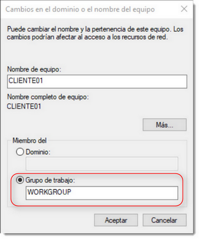
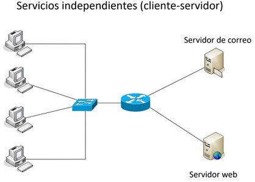
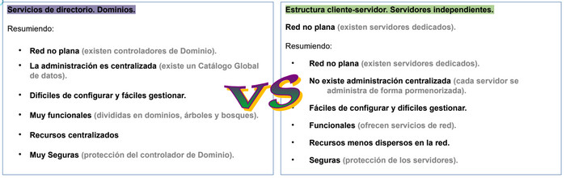

:::note[Conexión con el currículum]
**6. Opera sistemas en red gestionando sus recursos e identificando las restricciones de seguridad existentes.**	

a) Se ha configurado el acceso a recursos locales y recursos de red.  
b) Se han identificado y configurado los derechos de usuario y directivas de seguridad.  
c) Se han explotado servidores de ficheros, servidores de impresión y servidores de aplicaciones.  
d) Se ha accedido a los servidores utilizando técnicas de conexión remota.  
e) Se ha evaluado la necesidad de proteger los recursos y el sistema.  
f) Se han instalado y evaluado utilidades de seguridad básica.  
g) Se han configurado y explotado dominios.  
:::

## Sistemas de Organización de Redes

- En la actualidad no se concibe la idea de trabajar de forma aislada. Muy al contrario, cada vez está más presente la interconexión entre ordenadores formando redes.
- Desde redes pequeñas domésticas conocidas como PAN (Personal Area Network), redes de centros de trabajo LAN (Local Area Network) hasta las grandes redes WAN (Wide Area Network) que permiten interconectar redes entre sí, como lo es Internet.
- Será necesario un **Sistema Operativo de Red (SOR)** que gestione estas redes y los elementos que las componen.
- Sus tareas más importantes serán:
  - Gestión centralizada de recursos.
  - Ofrecer servicios a clientes.
  - Proporcionar acceso seguro a los recursos.
  - Monitorización de lo que está pasando en la red.

## 1. Red entre iguales. Estructura de trabajo en grupo.
- Una red plana entre iguales es aquella en la que ningún equipo realiza tareas de administración, solo de sí mismo. Cada cliente es administrador de los recursos que ofrece a la red y todos pueden acceder.
- No existe una administración centralizada. Si cada uno comparte lo que quiere cuando quiere sin que haya un control, la localización del recurso puede ser un grave problema.
- Microsoft introdujo en sus sistemas operativos la posibilidad de crear grupos de trabajo, que dividían la red en subconjuntos.

:::danger[Desventajas]
- Muy fácil de configurar y difíciles de gestionar. No existe un control de quien tiene acceso y quien no a los recursos.
- Poca funcionalidad.
- Recursos dispersos en la red.
- Muy insegura (usuarios "avanzados").
:::

## 2. Estructura Cliente-Servidor. Servidores Independientes.
- Red no plana (existen servidores dedicados).
- Es un modelo de aplicación distribuida, las tareas se dividen entre los proveedores de recursos y servicios.
- Un cliente realiza una petición a un servidor y éste le responde.
- Facilita la administración y la localización de recursos.

:::danger[Desventajas]
- Cada servidor mantiene su propia lista de usuarios y recursos.
- Si un cliente necesita acceder a múltiples servidores, requerirá múltiples cuentas y contraseñas.
- La sincronización entre servidores puede ser un problema.
:::

## 3. Servicios de Directorio y Dominios
- Un **servicio de directorio** es un conjunto de aplicaciones que guardan y administran la información sobre los elementos de una red.
- Un servicio de directorio ofrece una infraestructura para localizar, administrar y organizar los componentes y recursos de una red.
- Elementos clave:
  - **Directorio:** Repositorio único para información de usuarios y recursos.
  - **Dominio:** Conjunto de objetos dentro del directorio.
  - **Controlador de Dominio:** Servidor que autentica y administra accesos.
  - **Catálogo Global:** Base de datos con la información de todos los objetos de la red.

