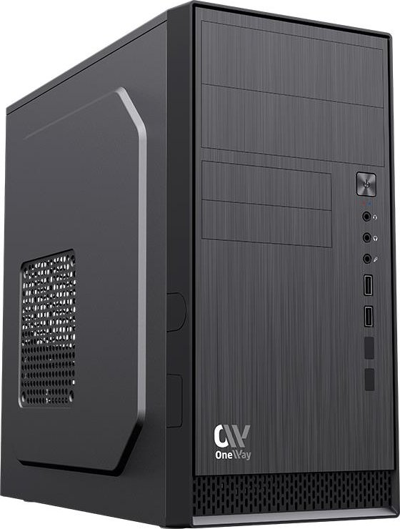
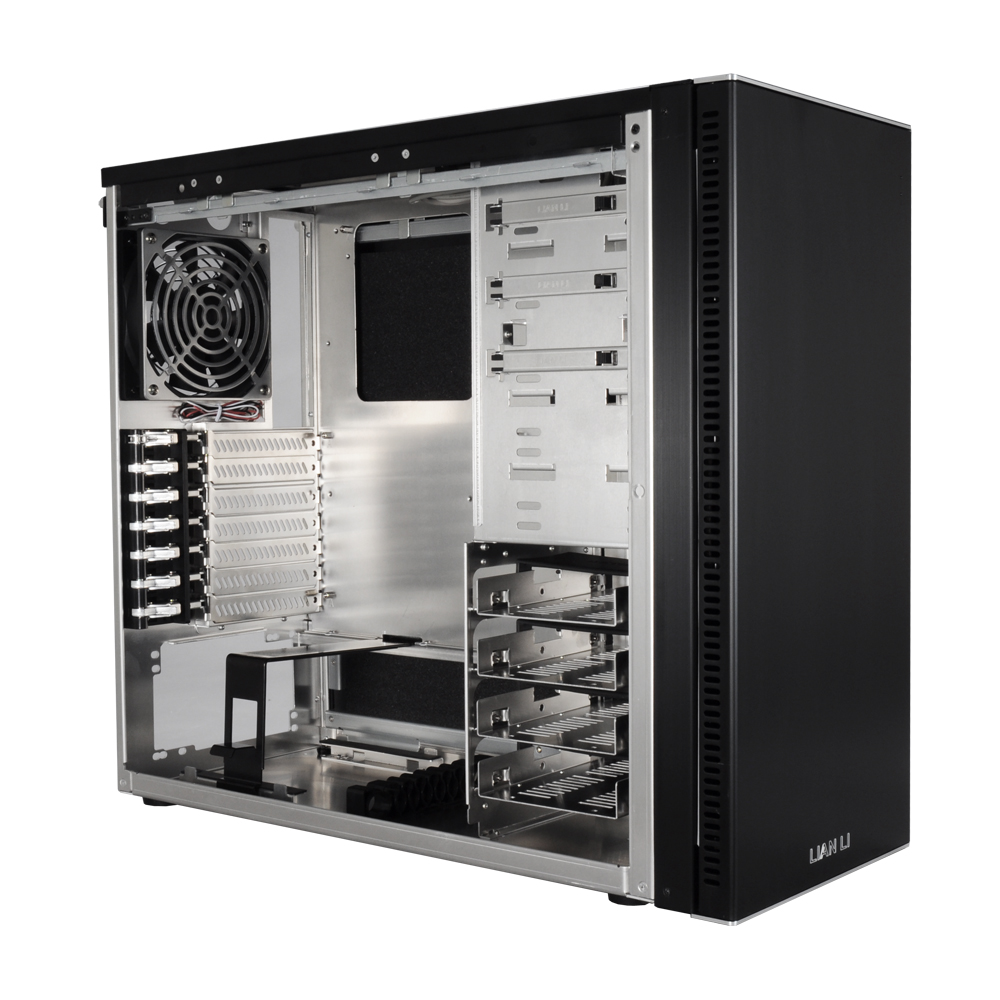
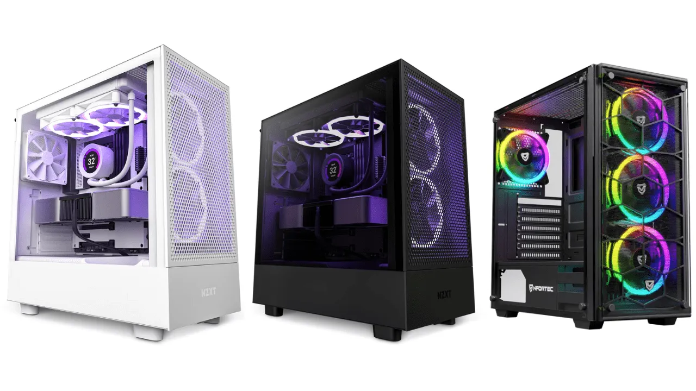

- Chasis que engloba y protege fisicamente el resto de componentes
- Condiciona al resto de componentes

### **Fuente de Alimentación**

La **fuente de alimentación** es un componente esencial en un sistema informático encargado de suministrar energía eléctrica a todos los dispositivos y componentes del ordenador. Su función principal es convertir la corriente alterna (CA) de la red eléctrica en corriente continua (CC) con los voltajes adecuados para alimentar el hardware del equipo (placa base, discos duros, tarjetas gráficas, etc.).

#### **Características de una Fuente de Alimentación**

1. **Conversión de Corriente:**
   - Convierte la corriente alterna (AC) que se recibe de la red eléctrica en corriente continua (DC) que utilizan los componentes del ordenador.
   - La conversión debe ser estable y eficiente para evitar fluctuaciones que puedan dañar el equipo.

2. **Voltajes de Salida:**
   - La fuente de alimentación proporciona diferentes voltajes según la necesidad de los componentes: 3.3V, 5V y 12V. Cada uno de estos se usa para distintos tipos de dispositivos, como el procesador, la memoria RAM y los discos duros.

3. **Potencia (Wattios):**
   - La capacidad de la fuente se mide en **wattios (W)** y determina cuánta energía puede suministrar al sistema. Una mayor potencia es necesaria en equipos con múltiples dispositivos o tarjetas gráficas de alto rendimiento.

4. **Conectores:**
   - Incluye diversos conectores para alimentar la placa base, CPU, discos duros, tarjetas gráficas, ventiladores y otros periféricos.
   - Los conectores más comunes son el ATX de 24 pines, EPS de 8 pines para la CPU, SATA para discos duros y PCIe para tarjetas gráficas.
  
  

1. **Eficiencia Energética:**
   - La eficiencia de una fuente de alimentación se mide por la cantidad de energía convertida en corriente útil frente a la energía que se pierde en forma de calor.
   - Las certificaciones como **80 PLUS** garantizan que la fuente tiene un mínimo de eficiencia (del 80% o superior) en diferentes niveles de carga.

#### **Tipos de Fuentes de Alimentación**
1. **ATX (Advanced Technology eXtended):**
   - Es el tipo más común para ordenadores de sobremesa. Proporciona todos los conectores y voltajes necesarios para alimentar la mayoría de componentes de un PC estándar.

2. **SFX (Small Form Factor):**
   - Utilizadas en equipos compactos o de pequeñas dimensiones, tienen un tamaño reducido pero siguen ofreciendo potencia similar a las ATX.

3. **Fuentes de Alimentación Modulares y Semi-Modulares:**
   - Permiten conectar solo los cables necesarios, lo que ayuda a mantener el interior del equipo más ordenado y facilita la ventilación.

4. **Fuentes Industriales:**
   - Diseñadas para servidores y sistemas de alta demanda. Ofrecen potencias más altas y protección adicional contra fallos eléctricos.

#### **Funciones de Protección**
Las fuentes de alimentación modernas incluyen varios mecanismos de protección para evitar daños a los componentes:
- **Protección contra sobretensiones (OVP):** Apaga la fuente si el voltaje supera el límite establecido.
- **Protección contra sobrecorriente (OCP):** Evita que una línea reciba más corriente de la que puede soportar.
- **Protección contra cortocircuitos (SCP):** Apaga el sistema si se detecta un cortocircuito.

:::tip[Ampliación]
[Fuentes de alimentación (es)](https://www.coolmod.com/blog/categorias/componentes/tipos-de-fuente-de-alimentacion-para-pc/)
:::

:::caution[activitad]
Practicum I
:::