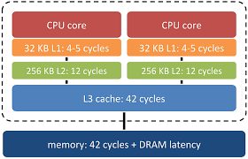

---
title: Procesador
description: Procesador de un Sistema Informático
---

### **1. Frecuencia (La Velocidad del Reloj)**

*   Se mide en **Gigahercios (GHz)**, que son miles de millones de ciclos por segundo.
*   **En cristiano:** Es la velocidad a la que el procesador hace sus cálculos. Un procesador de 3.5 GHz completa 3,500 millones de operaciones cada segundo.
*   **Ojo:** Aunque una frecuencia más alta suele significar más rapidez, no es el único factor que determina el rendimiento general de la CPU.

Monitor CPU de Windows 11. (ctrl + mayusculas + esc)

:::note
Un hercio (símbolo: Hz) es la unidad de medida de la frecuencia en el Sistema Internacional de Unidades (SI).
:::

### **2. Núcleos y Hilos (Cerebros y Brazos)**

*   **Núcleos (Cores):** Piensa en ellos como **"cerebros" independientes** dentro del procesador. Cuantos más núcleos, más tareas pesadas puede hacer a la vez, lo que es ideal para la multitarea.
*   **Hilos (Threads):** Son como los **"brazos" de cada cerebro**. Permiten gestionar las tareas dentro de un núcleo. Gracias a tecnologías como **Hyper-Threading** (Intel) o **SMT** (AMD), un solo núcleo puede manejar dos hilos a la vez, duplicando su capacidad para ciertas tareas.
*   **¡Importante! Arquitecturas Híbridas:** Los procesadores modernos mezclan dos tipos de núcleos para optimizar el rendimiento y el consumo:
    *   **Núcleos de Rendimiento (P-Cores):** Son los potentes, diseñados para las tareas más exigentes como juegos o edición de vídeo. En los procesadores Intel, solo los P-Cores suelen tener la capacidad de manejar dos hilos (Hyper-Threading).
    *   **Núcleos de Eficiencia (E-Cores):** Son los ahorradores. Se encargan de las tareas en segundo plano (como el antivirus u ofimática) consumiendo muy poca energía.
    *   Esta filosofía la usan casi todos los fabricantes: **Intel** (P-Cores/E-Cores), **AMD** (Zen 4/Zen 4c), **Apple** (Performance/Efficiency Cores) y **ARM** (big/LITTLE).
  
:::danger[FYI]
* Solo los P-core tienen hilos en intel. 
* AMD en todos los núcleos tiene hilos.
* ARM(APPLE) no tienen hilos pero si procesos en paralelo.
:::

### **3. Memoria Caché (La "Mesa de Trabajo" de la CPU)**

*   Es una **memoria súper rápida integrada en la propia CPU**. Su función es guardar los datos e instrucciones que se usan con más frecuencia para tenerlos a mano y no tener que ir a buscarlos a la memoria RAM, que es mucho más lenta.
*   **Se organiza en niveles:**
    *   **L1:** La más pequeña y veloz, pegada al núcleo.
    *   **L2:** Un poco más grande pero algo más lenta.
    *   **L3:** La más grande, compartida entre todos los núcleos.
    
    

### **4. Arquitectura (El "Idioma" del Procesador)**

Cuando hablamos de arquitecturas como x86 o ARM, en realidad nos referimos a su **"Conjunto de Instrucciones"**, que es como el diccionario de órdenes que el procesador entiende. Aquí es donde surgen dos filosofías de diseño totalmente opuestas: **CISC** y **RISC**.

:::note[CISC vs RISC]
| Característica | **CISC (Complex Instruction Set Computer)** | **RISC (Reduced Instruction Set Computer)** |
| :--- | :--- | :--- |
| **Enfoque / Filosofía** | **El Enfoque "Navaja Suiza"**. Realizar tareas complejas con la menor cantidad de instrucciones posible. | **El Enfoque "Caja de Herramientas"**. Usar instrucciones muy simples, donde cada una hace una sola cosa de forma ultrarrápida. |
| **Tipo de Instrucciones** | **Potentes y complejas**. Una sola instrucción puede ejecutar varias operaciones a la vez. | **Simples y reducidas**. Se necesitan varias instrucciones para realizar una tarea compleja. |
| **Ejemplos de Uso** | La arquitectura **x86**, utilizada por los principales fabricantes de PC como **Intel** y **AMD**. | La arquitectura **ARM**, estándar en *smartphones* y tabletas. |
| **Ventajas** | - Se necesitan menos líneas de código para programar una tarea. | - Las instrucciones se ejecutan muy rápido (generalmente en un ciclo de reloj). - Consumo de energía y generación de calor muy bajos. |
| **Desventajas** | - Las instrucciones tardan varios ciclos de reloj en completarse. - Mayor consumo de energía y generación de calor. | - Se necesitan más instrucciones (y más memoria) para completar tareas complejas. |
:::

 

### **5. Proceso de Fabricación (El Tamaño Sí Importa)**

*   Se mide en **nanómetros (nm)** y se refiere al tamaño de los transistores del chip.
*   **La regla de oro:** Cuanto **más pequeño es el número (ej. 7 nm o 5 nm), mejor**. Significa que caben más transistores en el mismo espacio, lo que se traduce en un procesador más potente, que consume _menos energía y genera menos calor_.

### **6. TDP (El Calor que Genera)**

*   El **TDP (Thermal Design Power)** se mide en vatios (W) e indica el calor que el procesador genera cuando está funcionando a máxima carga.
*   **¿Por qué es importante?** Un TDP más alto significa que el procesador consume más energía y necesitará un sistema de refrigeración más potente (un mejor disipador y ventilador) para no sobrecalentarse.

### **7. GPU Integrada (Gráficos "de Serie")**

*   Muchos procesadores incluyen una **Unidad de Procesamiento Gráfico (iGPU)**, es decir, una pequeña tarjeta gráfica integrada en el propio chip.
*   **¿Para qué sirve?** Es perfecta para tareas del día a día: navegar por internet, ofimática, ver vídeos en alta definición, etc..
*   **Ejemplos:**
    *   **Intel:** Sus procesadores con gráficos integrados suelen llevar la etiqueta **"G"** (ej. Intel Core i5-12400G). (Con "F" no tienen iGPU).
    *   **AMD:** Los procesadores con gráficos integrados se denominan **APU** (Accelerated Processing Unit), como los Ryzen 5 5600G o Ryzen 7 5700G.

### **8. Otros Factores Clave**

*   **Compatibilidad con RAM:** La CPU determina el tipo y la velocidad de memoria RAM que puedes instalar en tu sistema (por ejemplo, **DDR4** o **DDR5**).
*   **Overclocking:** Es la técnica para **aumentar la velocidad de reloj** de un procesador por encima de sus valores de fábrica. Es algo para usuarios avanzados, ya que genera más calor y requiere una refrigeración especial .
*   **Integración:** Los procesadores modernos integran funciones que antes estaban en la placa base, como el controlador de memoria. Esto reduce la latencia y aumenta el ancho de banda, haciendo el sistema más rápido y eficiente.
*   **Fabricantes:** Los dos gigantes del mercado de PC son **Intel** y **AMD**. AMD ha destacado en los últimos años por su excelente relación rendimiento/precio con los procesadores Ryzen, mientras que Intel sigue siendo un competidor muy fuerte, especialmente en tareas que dependen de un solo núcleo .
*   
:::tip[Ampliación]
- [Understanding Intel Processor Names - URL](https://www.intel.com/content/www/us/en/processors/processor-numbers.html)
- [Understanding AMD Processor Names - URL](https://medium.com/@meCreator/01-understanding-amd-processor-names-3a89261dcd99)

- [AMD and Intel processors naming](https://www.youtube.com/watch?v=ELJxau5qaQI)
- [Hiper Threading](https://www.youtube.com/watch?v=lrT9Bl0MCXQ)
:::

:::caution[actividad]
Practicum I - Placas Base y Procesadores
:::