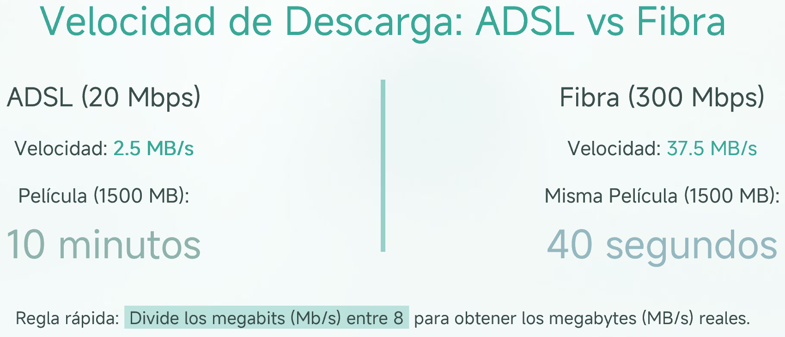
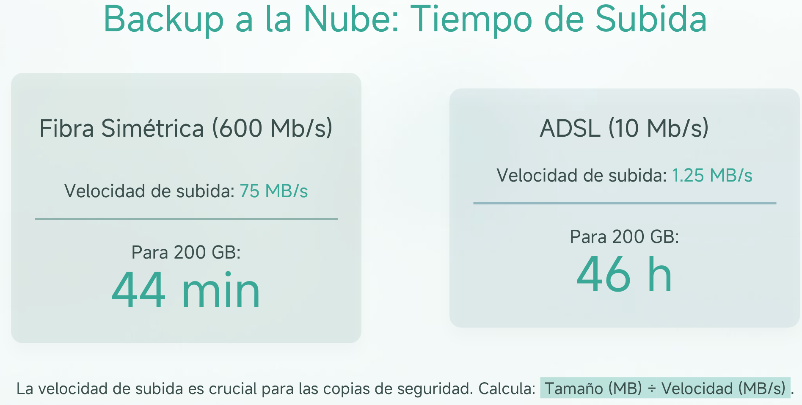
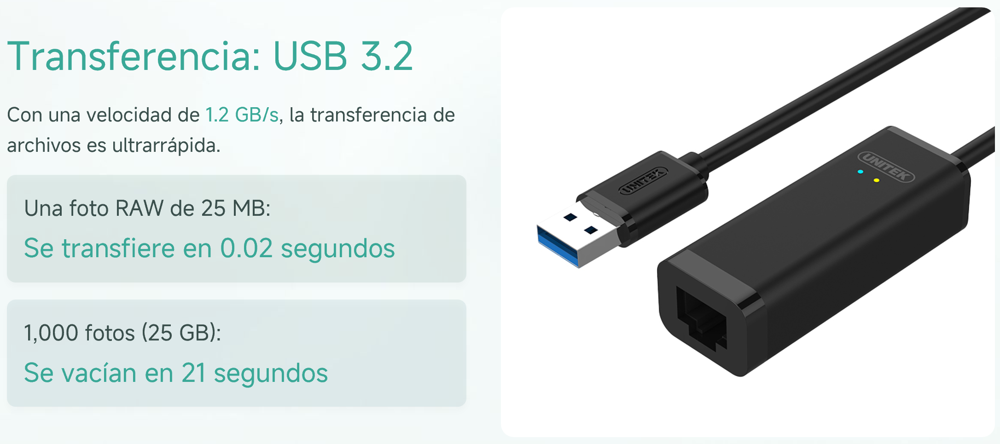

## Medidas de la Información

### **Tipos de Medidas**
- Existen dos tipos de medidas para la capacidad de información:
  1. **Sistema Internacional (SI):** Basado en unidades de 1000 en 1000.
  2. **ISO (Organización Internacional de Normalización):** Basado en unidades de 1024 en 1024.

Aunque la medida más utilizada en la nomenclatura es la del Sistema Internacional, los equipos internamente utilizan la norma ISO. Para simplificar, se usará el Sistema Internacional.

---

### **Medidas de la Información según el Sistema Internacional (SI)**

| Factor          | Valor                 | Símbolo | Nombre    |
|-----------------|-----------------------|---------|-----------|
| 10⁰             | 1                     | B       | Byte      |
| 10³             | 1.000                 | kB      | Kilobyte  |
| 10⁶             | 1.000.000             | MB      | Megabyte  |
| 10⁹             | 1.000.000.000         | GB      | Gigabyte  |
| 10¹²            | 1.000.000.000.000     | TB      | Terabyte  |
| 10¹⁵            | 1.000.000.000.000.000 | PB      | Petabyte  |
| 10¹⁸            | 1.000.000.000.000.000.000 | EB   | Exabyte   |
| 10²¹            | 1.000.000.000.000.000.000.000 | ZB   | Zettabyte |
| 10²⁴            | 1.000.000.000.000.000.000.000.000 | YB | Yottabyte |

---

### **Medidas de la Información según la Norma ISO/IEC 80000-13**

:::note
Intento de separar la nomenglatura para que no hubiese confusión. Poca aceptación. En alguna distribución de Linux
:::

| Factor          | Valor                 | Símbolo | Nombre      |
|-----------------|-----------------------|---------|-------------|
| 2⁰              | 1                     | B       | Byte        |
| 2¹⁰             | 1.024                 | KiB     | Kibibyte    |
| 2²⁰             | 1.048.576             | MiB     | Mebibyte    |
| 2³⁰             | 1.073.741.824         | GiB     | Gibibyte    |
| 2⁴⁰             | 1.099.511.627.776     | TiB     | Tebibyte    |
| 2⁵⁰             | 1.125.899.906.842.624 | PiB     | Pebibyte    |
| 2⁶⁰             | 1.152.921.504.606.846.976 | EiB | Exbibyte    |
| 2⁷⁰             | 1.180.591.620.717.411.303.424 | ZiB | Zebibyte    |
| 2⁸⁰             | 1.208.925.819.614.629.174.706.176 | YiB | Yobibyte    |

---

### **Conversión de Unidades**
Para convertir las unidades de medida, se utilizan las siguientes operaciones:
- **Multiplicación por 1000** en cada salto hacia unidades superiores (por ejemplo, de GB a TB).
- **División por 1000** en cada salto hacia unidades inferiores (por ejemplo, de TB a GB).
- Para convertir de bits a bytes o viceversa, se utiliza:
  - **Multiplicación por 8** para pasar de bytes a bits.
  - **División por 8** para pasar de bits a bytes.

**Ejemplo de Conversión:**
- Convertir las siguientes unidades:
  - 1 TB, 3.000 MB y 1.000.000 B

Aplicando las conversiones, se obtiene la siguiente tabla de referencia:

| b              | B    | KB  | MB  | GB  | TB  |
|---------------|------|-----|-----|-----|-----|
| 8.000.000.000.000 | 1.000.000.000.000 | 1.000.000.000 | 1.000.000 | 1.000 | **1** |
| 24.000.000.000       | 24.000.000.000    | 3.000.000     | **3.000**     | 3 | 0,0033 |
| 8.000.000            | **1.000.000**     | 1.000         | 1.0011    | 0.001 | 0     |

---

### **Medidas de Velocidad de Transferencia**
Para medir la cantidad de información que puede ser enviada o recibida por unidad de tiempo, se diferencian las siguientes medidas:

- **Transferencia en red**: Utiliza el bit como base y los múltiplos son de 1000.
- **Transferencia local**: Utiliza el byte como base y los múltiplos son de 1024 (como en el almacenamiento).

| Factor | Símbolo | Nombre               |   | Factor | Símbolo | Nombre                |
| ------ | ------- | -------------------- | - | ------ | ------- | --------------------- |
| 10⁰    | b/s     | Bit por segundo      | - | 2⁰     | B/s     | Byte por segundo      |
| 10³    | Kb/s    | Kilobit por segundo  | - | 2¹⁰    | KB/s    | Kilobyte por segundo  |
| 10⁶    | Mb/s    | Megabit por segundo  | - | 2²⁰    | MB/s    | Megabyte por segundo  |
| 10⁹    | Gb/s    | Gigabit por segundo  | - | 2³⁰    | GB/s    | Gigabyte por segundo  |
| 10¹²   | Tb/s    | Terabit por segundo  | - | 2⁴⁰    | TB/s    | Terabyte por segundo  |
| 10¹⁵   | Pb/s    | Petabit por segundo  | - | 2⁵⁰    | PB/s    | Petabyte por segundo  |
| 10¹⁸   | Eb/s    | Exabit por segundo   | - | 2⁶⁰    | EB/s    | Exabyte por segundo   |
| 10²¹   | Zb/s    | Zettabit por segundo | - | 2⁷⁰    | ZB/s    | Zettabyte por segundo |

¿Cúanto tardará, en minutos, descargar un ADLS de 20Mbps una película de 1500MB? ¿Y una conexión de fibra de 300Mb/s(en segundos)?

Tienes que subir tu video de tu última escapada, 200GB, a Youtube para compartirlo con tus amigas ¿Cúanto tardará, en minutos u horas, si tienes una conexión de ADSL de 10Mbps?¿cuánto tardarías si tuvieras una conexión de fibra de 600Mbps?

### **Tasa de Transferencia Según el Tipo de Transmisión**

| Tipo de Transmisión | Tasa de Transferencia   |
|---------------------|------------------------|
| ADSL                | ~ 2,5 Mbps (hasta 20 Mbps) |
| Fibra               | ~ 100 Mbps (300, 600, según contrato) |
| 4G                  | ~ 300 Mbps             |
| 5G                  | ~ 10 Gbps              |
| USB 1.0             | ~ 200 KB/s             |
| USB 3.2             | ~ 1,2 GB/s             |
| ATA                 | ~ 100 MB/s             |
| SATA 3.2            | ~ 2 GB/s               |
| PCI-E v4 x16        | ~ 63 GB/s              |

Tienes una foto que has hecho con tu IPhone en RAW. ¿Cuánto tardarías en transferirla a tu ordenador si utilizas un USB 3.2 (1.2 GB/s)?¿Y las fotos de del pasado verano en la playa (25GB)?

:::caution[actividad]
Medidas de información
:::