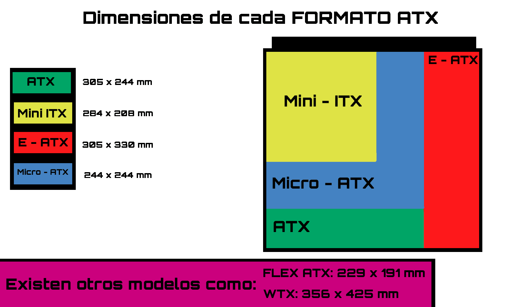
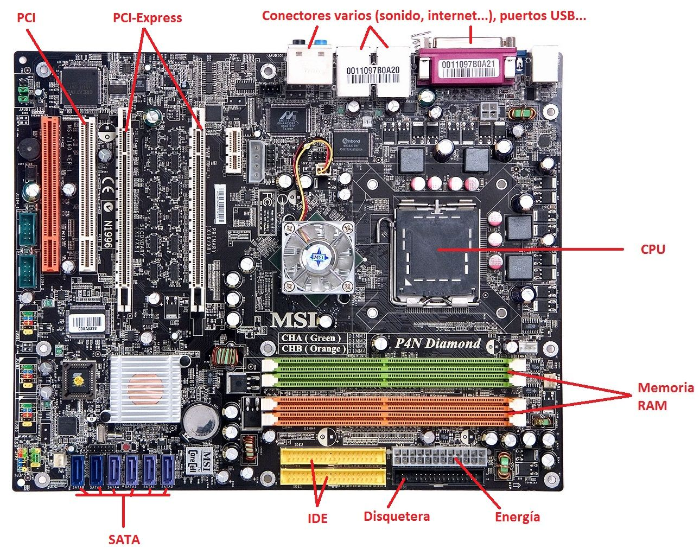
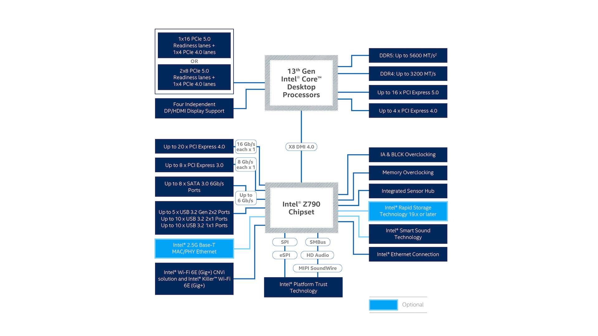
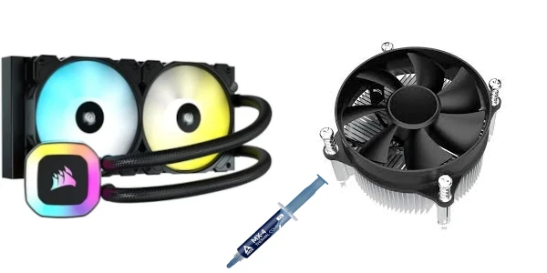
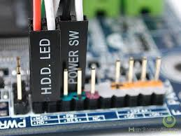
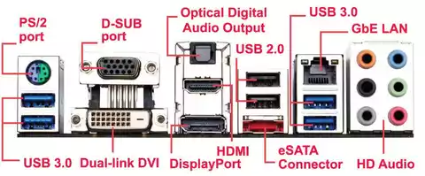
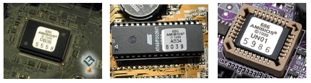

La placa base es un circuito impreso con distintas formas estándar, que permiten que el resto de los componentes se conecten entre ellos

## 1. Factor de forma de una placa base 
Se refiere a sus dimensiones físicas, el diseño de sus conectores y la disposición de sus componentes. Determina qué tipo de carcasa o gabinete puede alojar la placa, así como el tipo de componentes que se pueden instalar. Los principales factores de forma para placas base son:

## 2. Componentes de la placa base

### Chipset

Chips en la placa base que actúa como un puente de comunicación entre el procesador (CPU) y otros componentes del ordenador, como la memoria RAM, almacenamiento, tarjetas gráficas, puertos USB y otros dispositivos periféricos.

### Socket

El zócalo donde se coloca el procesador, permitiendo que la CPU se comunique con el resto de los componentes del sistema a través de la placa base.

Cada procesador está diseñado para un tipo específico de socket.

- Intel: LGA 1200, LGA 1700, etc.
- AMD : AM4(PGA), AM5(PGA), TR4(LGA), etc.

### Refrigeración de la CPU

- Refrigeración líquida, Pasta térmica y ventilador

### Conectores frontales y posteriores

### PCI-Express 
**PCI-Express (PCIe)** es una interfaz de conexión de alta velocidad utilizada para conectar componentes como tarjetas gráficas, SSD y tarjetas de red a la placa base. 

#### Características
- **Arquitectura basada en carriles**: Cada carril tiene líneas para enviar y recibir datos. Las configuraciones más comunes son x1, x4, x8 y x16.
- **Versiones y velocidad**: Con cada versión, aumenta el ancho de banda. PCIe 4.0 ofrece 2 GB/s por carril, mientras que PCIe 5.0 alcanza 4 GB/s.
- **Compatibilidad**: PCIe es retrocompatible, aunque los dispositivos funcionarán a la velocidad de la versión más baja.
- **Uso en GPUs y SSDs**: Tarjetas gráficas usan PCIe x16 para mayor ancho de banda, y los SSD NVMe aprovechan PCIe para alta velocidad.

### Otros compoentes

- Pila botón para BIOS/UEFI
- BIOS/UEFI

El BIOS (Basic Input/Output System) y UEFI (Unified Extensible Firmware Interface) son dos tipos de firmware que se encuentran en las placas base y se ejecutan cuando se enciende el ordenador para inicializar el hardware y arrancar el sistema operativo

- **Limitaciones BIOS**:
  - Soporta solo discos de hasta **2 TB** de tamaño.
  - Trabaja en **modo de 16 bits**, lo que limita su velocidad y capacidades.
  - Sólo puede arrancar desde discos con **MBR** (Master Boot Record).

- **Ventajas UEFI**:
  - Soporta discos de más de **2 TB** y hasta **9 ZB**.
  - Soporta el **arranque rápido**.
  - Trabaja en **modo de 32 o 64 bits**, lo que mejora el rendimiento y la capacidad de manejo del hardware.
  - Puede arrancar desde discos con **GPT** (GUID Partition Table).
  - Ofrece mejores características de seguridad, como **Secure Boot**, que impide la ejecución de software malicioso durante el arranque.
  - Tiene una interfaz gráfica, a menudo con soporte para ratón y más opciones configurables.