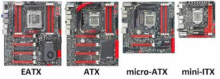

El **factor de forma de una placa base** se refiere a sus dimensiones físicas, el diseño de sus conectores y la disposición de sus componentes. Determina qué tipo de carcasa o gabinete puede alojar la placa, así como el tipo de componentes que se pueden instalar. Los principales factores de forma para placas base son:

### 1. **E-ATX (Extended ATX)**
   - **Tamaño**: 305 mm x 330 mm (12 x 13 pulgadas).
   - **Características**: 
     - Más grande que el ATX estándar.
     - Soporta más ranuras de expansión, mayor número de módulos de RAM y más conectores.
     - Ideal para configuraciones avanzadas, como estaciones de trabajo de alto rendimiento o equipos para entusiastas.
   - **Uso**: Servidores, estaciones de trabajo profesionales y PCs gaming de gama alta.

### 2. **ATX (Advanced Technology eXtended)**
   - **Tamaño**: 305 mm x 244 mm (12 x 9.6 pulgadas).
   - **Características**: 
     - Soporta hasta 7 ranuras de expansión (como PCIe para tarjetas gráficas).
     - Ideal para PC de escritorio de alto rendimiento.
     - Suele tener más puertos y ranuras que otros factores de forma.
   - **Uso**: Común en PCs de escritorio, gaming, y estaciones de trabajo.

### 3. **Micro-ATX**
   - **Tamaño**: 244 mm x 244 mm (9.6 x 9.6 pulgadas).
   - **Características**: 
     - Menor que el ATX, pero compatible con muchas cajas ATX.
     - Soporta hasta 4 ranuras de expansión.
     - Menos puertos y conectores, pero suficiente para la mayoría de los usuarios.
   - **Uso**: PCs de escritorio más compactos, pero con capacidad suficiente para tareas comunes y juegos.

### 4. **Mini-ITX**
   - **Tamaño**: 170 mm x 170 mm (6.7 x 6.7 pulgadas).
   - **Características**: 
     - Diseñada para sistemas muy compactos.
     - Solo tiene 1 ranura de expansión (normalmente PCIe).
     - Menos puertos y conectores disponibles en comparación con ATX y micro-ATX.
     - Consume menos energía.
   - **Uso**: Sistemas compactos, como HTPCs (Home Theater PCs), PCs para trabajo ligero y algunos PCs gaming compactos.

### 5. **BTX (Balanced Technology Extended)** 
   - **Tamaño**: Varía, pero una versión común es 325 mm x 267 mm.
   - **Características**: 
     - Diseñado para mejorar la eficiencia térmica y del flujo de aire.
     - Colocación diferente de los componentes para mejor refrigeración.
   - **Uso**: Aunque fue diseñado para reemplazar al ATX, no se adoptó ampliamente.

### Consideraciones importantes del factor de forma
- **Compatibilidad con gabinetes**: Cada factor de forma requiere una carcasa compatible. Las cajas ATX suelen ser las más versátiles, ya que pueden albergar placas ATX, micro-ATX y mini-ITX.
- **Número de ranuras de expansión**: Los factores de forma más grandes (como ATX o E-ATX) ofrecen más ranuras para tarjetas gráficas, de sonido o de red.
- **Capacidad de refrigeración**: Las placas más grandes suelen permitir más espacio para soluciones de refrigeración, mientras que las más pequeñas pueden requerir soluciones más compactas.
- **Tamaño del equipo**: Un sistema más compacto como mini-ITX es ideal para espacios reducidos, mientras que los sistemas ATX o E-ATX son preferidos por los usuarios que necesitan expandir y mejorar sus equipos.

El factor de forma adecuado dependerá de las necesidades de rendimiento y espacio del usuario.

:::note
La diferencia principal entre ATX y ITX radica en su tamaño, capacidad de expansión y el tipo de uso al que están orientadas.
:::
