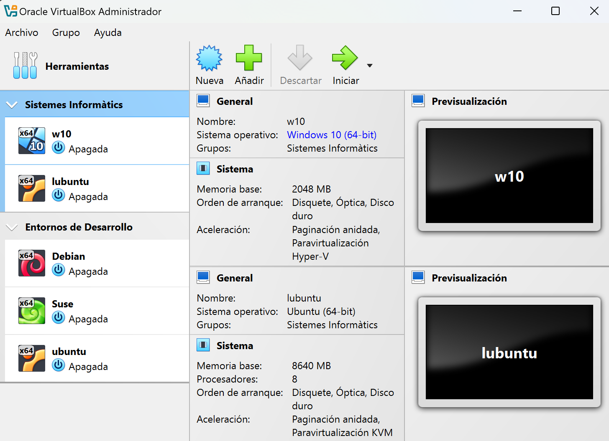

### 1. Guest Additions

**Guest Additions** es un conjunto de programas que mejoran la experiencia del usuario y la eficiencia de las máquinas virtuales. Entre las mejoras que proporciona se incluyen:

- **Soporte para pantalla completa**: Permite ajustar la resolución de la pantalla al tamaño del monitor del host.
- **Carpetas compartidas**: Facilita el intercambio de archivos entre el sistema host y el sistema guest.
- **Mejora del rendimiento gráfico**: Proporciona un controlador gráfico optimizado para el sistema guest.
- **Funcionalidad "arrastrar y soltar"**: Permite mover archivos entre el host y el guest simplemente arrastrándolos.

### 2. Snapshots (instantáneas)

Las **snapshots** permiten hacer una captura del estado de la máquina virtual en un momento determinado. Es una herramienta muy útil cuando se hacen cambios importantes, como la instalación de nuevo software o la configuración del sistema:

- **Restauración rápida**: Permite volver a un estado anterior si algo sale mal durante una instalación o prueba.
- **Múltiples snapshots**: Se pueden crear varias instantáneas para tener diferentes puntos de restauración.

### 3. Soporte para USB

VirtualBox permite el **soporte para dispositivos USB** conectados al host. Esto significa que los dispositivos USB pueden ser reconocidos y utilizados por las máquinas virtuales:

- **USB 2.0 y USB 3.0**: Con el paquete de extensiones instalado, es posible utilizar dispositivos USB de alta velocidad.
- **Montaje de dispositivos automático**: VirtualBox puede montar automáticamente los dispositivos USB conectados para facilitar su uso.

### 4. Módulo de Red Avanzada

**VirtualBox** ofrece varias opciones de configuración de red para las máquinas virtuales:

- **NAT**: Permite que el guest acceda a internet a través del host.
- **Bridged Networking**: Hace que el sistema guest aparezca como un dispositivo más de la red local, permitiendo la comunicación directa con otros dispositivos.
- **Internal Network**: Las máquinas virtuales pueden comunicarse entre ellas, pero no con la red externa.
- **Host-Only Networking**: Solo permite la comunicación entre el host y las máquinas virtuales, sin acceso a la red externa.

### 5. Carpetas Compartidas

Las **carpetas compartidas** permiten compartir directorios entre el sistema host y la máquina virtual. Esto es muy útil para transferir archivos sin tener que usar medios externos.

### 6. Remote Display Protocol (RDP)

VirtualBox proporciona un **servidor RDP** integrado, que permite acceder a la máquina virtual desde cualquier dispositivo compatible con el protocolo **Remote Desktop**. Esto es especialmente útil para trabajar de manera remota:

- **Control remoto completo**: Permite gestionar completamente la máquina virtual desde cualquier lugar.
- **Conexiones multiusuario**: Es posible que varios usuarios se conecten a la misma máquina virtual, compartiendo recursos y tareas.

### 7. Exportación e Importación en Formato OVA

Las máquinas virtuales creadas con VirtualBox pueden ser **exportadas** en un formato **OVA** (Open Virtual Appliance), que es compatible con otras soluciones de virtualización. Esto permite la portabilidad entre plataformas.

### 8. Integración con la Nube

VirtualBox ofrece integración con la nube, permitiendo la **creación de máquinas virtuales en la nube** y la conexión directa con Oracle Cloud Infrastructure:

- **Migración fácil**: Montar una máquina virtual en la nube para aumentar la disponibilidad y la escalabilidad.
- **Backup remoto**: Guardar copias de seguridad de las máquinas virtuales para asegurar su integridad.

## Instalación de Guest Additions

Para instalar **Guest Additions** en una máquina virtual:

1. **Iniciar la máquina virtual**.
2. Seleccionar **Dispositivos > Insertar imagen de CD de Guest Additions**.
3. Seguir las instrucciones para completar la instalación.
4. **Reiniciar** la máquina virtual después de la instalación.

## Creación y Administración de Grupos

**VirtualBox** permite organizar máquinas virtuales en **grupos** para facilitar su administración, sobre todo cuando se manejan múltiples máquinas. Esta característica ayuda a realizar acciones comunes sobre varias máquinas al mismo tiempo.

### 1. **Creación de Grupos**

Para crear un grupo en VirtualBox:
1. **Seleccionar las máquinas virtuales** que deseas agrupar, manteniendo presionada la tecla **Ctrl**.
2. **Clic derecho** sobre cualquiera de las máquinas seleccionadas y elige la opción **"Crear grupo"**.

### 2. **Administración de Grupos**

Una vez que las máquinas están agrupadas, se pueden realizar diversas acciones en ellas de forma simultánea:

- **Iniciar o Detener**: Puedes iniciar o detener todas las máquinas del grupo con un solo clic.
- **Eliminar Grupo**: Selecciona el grupo y haz clic derecho para eliminarlo.
- **Configurar Grupo**: Puedes modificar configuraciones compartidas por las máquinas del grupo.

:::caution[actividad]
Virtualbox Advanced
:::