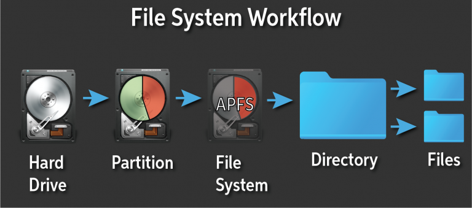

:::note[Connexión con el currículum]
RA: 3 - CE: a, b, c
:::

## Sistemas de archivos

Un sistema de archivos es como un **índice o catálogo** que un sistema operativo utiliza para organizar y almacenar datos en un dispositivo de almacenamiento, como un disco duro, una unidad de estado sólido (SSD) o una memoria USB.

 

### ¿Por qué son importantes?

-   **Organización:** Permiten organizar los datos de forma jerárquica en directorios y archivos, lo que facilita su localización y acceso.
-   **Gestión del espacio:** Administran el espacio disponible en el dispositivo de almacenamiento, asignando espacio a los archivos y manteniendo un registro del espacio libre.
-   **Acceso a los datos:** Proporcionan mecanismos para leer, escribir y modificar los datos almacenados en los archivos.
-   **Seguridad:** Permiten establecer permisos de acceso a los archivos, controlando quién puede leerlos, escribirlos o ejecutarlos.
  

### Características de un sistema de archivos

-   **Formato:** Cada sistema de archivos tiene un formato específico que define cómo se organizan los datos en el dispositivo.
-   **Compatibilidad:** Los sistemas operativos suelen ser compatibles con varios sistemas de archivos, pero algunos son específicos de un sistema operativo en particular.
-   **Rendimiento:** El rendimiento de un sistema de archivos puede variar en función de su diseño y de las operaciones que se realicen.
-   **Fiabilidad:** Un buen sistema de archivos debe ser fiable y proteger los datos de posibles errores o fallos.

### Comparativa de Sistemas de Archivos NTFS, EXT4 y HFS+

| Característica                      | NTFS (Windows)                                                               | EXT4 (Linux)                                                                   | HFS+ (macOS)                                                           |
| ----------------------------------- | ---------------------------------------------------------------------------- | ------------------------------------------------------------------------------ | ---------------------------------------------------------------------- |
| **Journaling**                      | Sí                                                                           | Sí, con journaling mejorado respecto a EXT3                                    | Sí                                                                     |
| **Tamaño máximo de archivo**        | 16 TB                                                                        | 16 TB                                                                          | 8 EB                                                                   |
| **Tamaño máximo de volumen**        | 256 TB                                                                       | 1 Exabyte (EB)                                                                 | 8 EB                                                                   |
| **Rendimiento**                     | Óptimo en discos SSD y HDD de gran capacidad                                 | Rendimiento optimizado para acceso simultáneo                                  | Diseñado para dispositivos Apple con optimización para hardware propio |
| **Compatibilidad con USB/Pendrive** | Sí, exFAT y FAT32 para menor compatibilidad                                  | EXT4 (Linux), FAT32 o exFAT para compatibilidad con Windows                    | HFS+, FAT32, exFAT                                                     |
