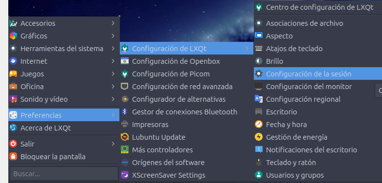
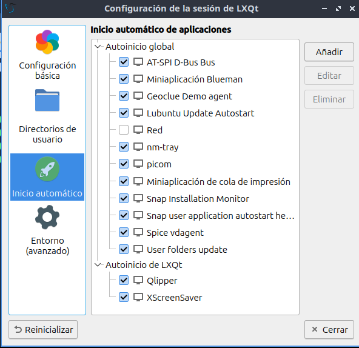

1. **Crea un script** que abra la carpeta y hazlo ejecutable:
   - Puedes usar botón derecho sobre el escritorio y ejecutar "abrir en un terminal" 
      ```bash title="Terminal"
      mkdir ~/Desktop/TAREAS_DEL_DÍA
      nano ~/Desktop/TAREAS_DEL_DÍA/abrir_tareas.sh
      ```
   - y escribe el siguiente script:
     ```bash title="LXQt"
      #!/bin/bash
      pcmanfm-qt ~/Desktop/TAREAS_DEL_DÍA
      #pcmanfm-qt es el comando para abrir el explorador de archivos predeterminado de lubuntu. Este puede variar según distribución.
     ```
   - Guarda el archivo y hazlo ejecutable:
     ```bash
     1. Para salir en nano: ctrl+x
     2. Para confirmar en nano:`s o S`
     3. Para hacer ejecutable: chmod +x ~/Desktop/TAREAS_DEL_DÍA/abrir_tareas.sh
     ```

2. **Agrega el script a las aplicaciones de inicio**:
   - En el menú de aplicaciones de tu sistema, busca "Aplicaciones al inicio" o "Aplicaciones de inicio".
  
   - Haz clic en **Añadir**.
   
   - En **Nombre**, escribe "Abrir Tareas del Día".
   - En **Comando**, selecciona el script (`/ruta/donde/guardaste/abrir_tareas.sh`).
   - Haz clic en **Añadir** o **Guardar**.
