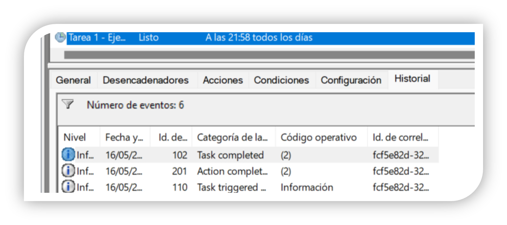
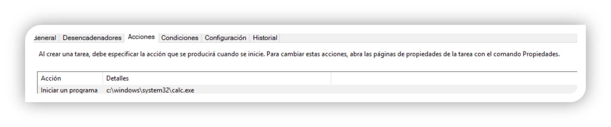
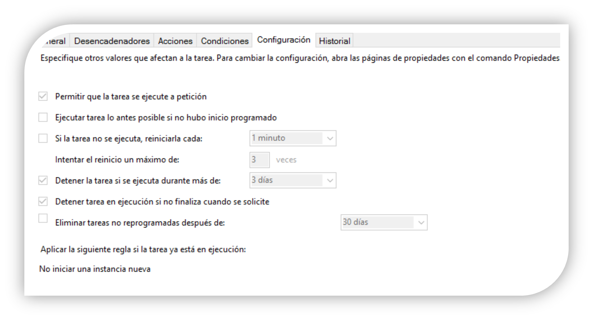

## Gestión de Tareas Programadas en Windows

Una tarea programada es una acción que el sistema operativo realizará en alguna de las siguientes circunstancias:

- Cuando llegue un momento determinado en el futuro.
- Cuando se produzca un determinado evento.
- Con una frecuencia determinada.

De esta manera, podremos planificar y programar aquellas acciones que deseamos que se realicen, evitando posibles olvidos. Para ello, utilizaremos el programador de tareas. Para acceder a él entraremos en **Panel de control > Herramientas administrativas > Programador de tareas** o también podemos hacerlo mediante el comando `taskschd.msc`.

La forma más sencilla de programar una tarea es hacer clic en **Crear tarea básica** (situado en el menú de acciones a la derecha). A continuación, aparecerá un asistente que nos ayudará a crear la tarea planificada.

Indicaremos cuándo o debido a qué queremos que se ejecute la tarea. En esta pantalla, seleccionaremos una de las opciones dependiendo de cómo o cuándo queremos que se ejecute la tarea (diariamente, semanalmente, mensualmente, una vez, inicio de sesión, fin de sesión, o vinculado a un evento particular).

Por ejemplo, vamos a establecer que la tarea se ejecute diariamente a una hora determinada.

A continuación, indicaremos la **acción a realizar**. En este caso podremos indicar la ejecución de un programa, enviar un correo electrónico, mostrar un mensaje, etc. 

Como ejemplo, vamos a crear una tarea sencilla: abrir la calculadora de Windows a una hora determinada todos los días.

Accediendo a la tarea creada podemos modificarla y añadir acciones o condiciones. También es posible consultar las ejecuciones (o intentos fallidos) de cada tarea. Para ello, primero debemos habilitar la opción de historial (en Windows 11).

Las opciones que se encuentran en las pestañas **General**, **Desencadenadores**, **Acciones**, **Condiciones** y **Configuración** se pueden configurar directamente si creamos una tarea desde la opción **Crear Tarea** (no utilizando "Crear tarea básica").

- En la pestaña **General**, podemos modificar la descripción de la tarea y establecer las opciones de seguridad adecuadas.
- En la pestaña **Desencadenadores**, podemos ver y modificar los datos relativos a los criterios que deben cumplirse para iniciar la ejecución de la tarea.

  
- La siguiente pestaña contiene las **acciones** asociadas a la tarea programada. Si hubiese más de una, se ejecutarían en orden secuencial.

  
- En la pestaña **Condiciones**, se indican los criterios que deben cumplirse para que el desencadenador se active (por ejemplo, que el equipo esté conectado a corriente alterna).

  
- En la pestaña **Configuración**, se indican algunas cuestiones complementarias sobre cómo debe comportarse el sistema en relación con la tarea (por ejemplo, que la tarea se detenga si se ejecuta durante más de 3 días).

