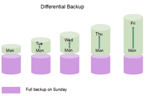
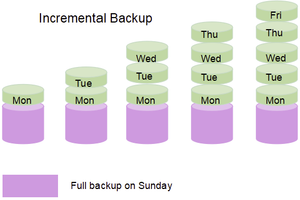

:::note[Connexión con el currículum]
RA: 3 - CE: e, f, g
:::

## 1. Introducción a las Copias de Seguridad
  Una copia de seguridad es una copia de los datos importantes de un sistema informático que se realiza con el objetivo de:
    
  - **Recuperación de datos** (en caso de pérdida o daño)
  - **Continuidad del negocio**
  - **Protección contra ransomware**
    - El ransomware cifra los datos y exige un rescate para su recuperación
  - **Cumplimiento legal**
    -  En algunos sectores, las empresas están obligadas por ley a realizar copias de seguridad de ciertos datos
### Tipos de copias de seguridad
- **COMPLETA:** Copia la totalidad de los datos por eso tarda menos tiempo en recuperarlos, por lo contrario lleva mucho tiempo realizar una copia de seguridad, depende del tamaño de datos a respaldar.
- **DIFERENCIAL:** El lunes se hace una copia de seguridad sólo de los archivos que han cambiado desde el domingo, el martes se hace una copia de seguridad sólo de los archivos que han cambiado desde el domingo, y así sucesivamente hasta la siguiente copia de seguridad completa.
 

- **INCREMENTAL:**  Las copias de seguridad incrementales también hacen una copia de seguridad sólo de los datos modificados, pero sólo de los datos que han cambiado desde la última copia de seguridad, ya sea completa o incremental.

### Métodos de almacenamiento
- Almacenamiento local (discos duros externos, NAS).
- Almacenamiento en la nube (Google Drive, Dropbox, Amazon S3).

## Realización de Copias de Seguridad
   - **Herramientas para realizar copias de seguridad**:
     - **Windows Backup / historial de archivos**: Herramienta nativa en sistemas Windows.
     - **Time Machine** (MacOS): Sistema de copia de seguridad automático.
     - **Duplicati** y **Veeam Backup**: Software de copias de seguridad para Windows, Linux y MacOS.
     - **rsync**: Comando para hacer copias de seguridad en Linux.

---

## 2. Planificación y Automatización de Tareas
   - La planificación de tareas es un proceso que sirve para organizar y gestionar el tiempo de manera eficiente. Consiste en identificar y programar las tareas que se deben realizar

### Programación de tareas en el sistema operativo

- **Windows**: El "**[Programador de tareas](../ut32a1)**" permite automatizar tareas como la ejecución de programas, el envío de correos electrónicos o la realización de copias de seguridad.
- **Linux**: **Cron** es una herramienta que permite programar la ejecución de comandos o scripts en momentos específicos. Para inicio de sesión existe la automatización del propio sistema con [aplicaciones de inicio](../ut32a2)
  
:::tip
[crontab guru](https://crontab.guru)
:::

### Scripts

- **Bash** (Linux): Permite automatizar tareas en sistemas Linux, como la gestión de archivos, la configuración del sistema o la ejecución de programas.

- **PowerShell** (Windows): Similar a Bash, pero para Windows. Permite automatizar tareas administrativas y de gestión del sistema.

:::caution[Actividad]
Backups y automatización
:::

[n8n](../ut32a3)