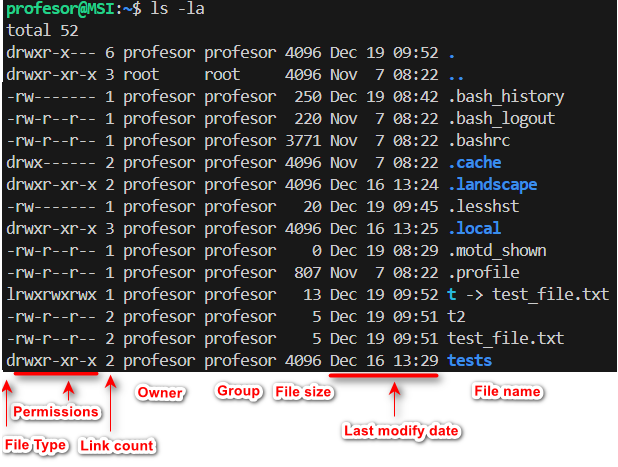

## Conceptos básicos

```bash
# Comprobar si WSL está instalado:
wsl --status
# Ejecutar WSL:
wsl o simplemente buscarlo en el menú inicio como "WSL" (icono pinguino)
# Listar las distribuciones disponibles:
wsl --list --online
# Instalar WSL en Windows 10/11, abre PowerShell como administrador y ejecuta:
wsl --install Ubuntu
```
:::tip[WSL - Carpetas personales]
> - **/home/USUARIO-LINUX/** # Carpeta personal en Linux
> - **/mnt/c/Users/USUARIO-HOST/** # Carpeta personal en HOST (Windows)
:::


:::tip[WS - Establecer Ubuntu por defecto]
> En caso de que WSL se cierre inmediatamente al iniciar, se debe establecer Ubuntu por defecto
> - Establece Ubuntu por defecto: `wsl --set-default Ubuntu`
:::

### Prompt de Linux

- El **prompt** muestra información útil como el usuario, la máquina y el directorio actual.
  - Ejemplo: `beatriz@ubuntu:~$`
  - `$`: Usuario sin privilegios.
  - `#`: Usuario con privilegios root.

### **Comandos y Entrada/Salida Estándar**

1. Los comandos en Linux son **palabras reservadas** utilizadas por el sistema operativo para ejecutar programas a través de una terminal o línea de comandos.

   - **Sintaxis general:**
     ``` frame="none"
     orden [-opciones] argumento1 argumento2
     ```
   - **Agrupación de opciones:**
     ``` frame="none"
     ls -l -a = ls -la
     ```


1. **Diferenciación entre mayúsculas y minúsculas:**
   En Linux, **las mayúsculas y minúsculas son diferentes**, por lo que debes prestar atención al escribir los comandos.

### **Entrada y Salida Estándar en Linux**

Todo programa en Linux trabaja con tres tipos de flujos principales:

- **Entrada estándar** (stdin): Teclado.
- **Salida estándar** (stdout): Pantalla.
- **Salida de error** (stderr): Pantalla.

### Redirección, contatenación y ayuda

- `>` y `>>`: Redirigen la salida a un archivo.
  - Ejemplo: `ls -a > fichero.txt`
- `<`: Redirige la entrada desde un archivo.
  - Ejemplo: `wc < fichero.txt`
- **Tuberías**: Permiten que la salida de un comando se convierta en la entrada de otro.
  - comando1 | comando2 | comando3  
  - Ejemplo: `cat /etc/passwd | wc -l`

- **Concatenación**: Ejecuta comandos de forma secuencial sin relación:  
  - comando1 && comando2 && comandoN  
  - Ejemplo: `cat /etc/passwd && cat /etc/groups`
- **Ayuda sobre Comandos**
  - **man**: Muestra una página de ayuda completa.  
    - `man pwd`  
  - **help**: Proporciona ayuda rápida.  
    - `pwd --help`  


## **Comandos**
### **Comandos Básicos**

| **Comando** | **Descripción**                         | **Ejemplo**               |
|-------------|-----------------------------------------|---------------------------|
| **pwd**     | muestra la ruta actual.                | `pwd`                     |
| **cd**      | cambia de directorio.                  | `cd /home/usuario`        |
| **ls**      | lista archivos.                        | `ls -l`                   |
| **mkdir**   | crea directorios.                      | `mkdir nueva_carpeta`     |
| **rm**      | borra ficheros o directorios.          | `rm archivo.txt`          |
| **mv**      | mueve ficheros o directorios.          | `mv archivo.txt carpeta/` |
| **cp**      | copia ficheros o directorios.          | `cp archivo.txt copia.txt`|
| **uname**   | muestra información del sistema.       | `uname -a`                |
| **shutdown** | apaga o reinicia el equipo.                        | `shutdown now` o `shutdown -r`  |
| **reboot**   | reinicia el equipo.                                | `reboot`                        |
| **clear**    | limpia la pantalla del terminal.                   | `clear`                         |
| **date**     | muestra la fecha y hora del sistema.               | `date`                          |
| **cal**      | muestra el calendario del mes o año indicado.      | `cal 2024`                      |
| **who**      | muestra quién está conectado al sistema.           | `who`                           |
| **type**     | Para saber si un comando existe.                   | `type ls`                       |
| **touch**   | Para crear un archivo vacío o actualizar la marca de tiempo de un archivo. | `touch archivo.txt` |
