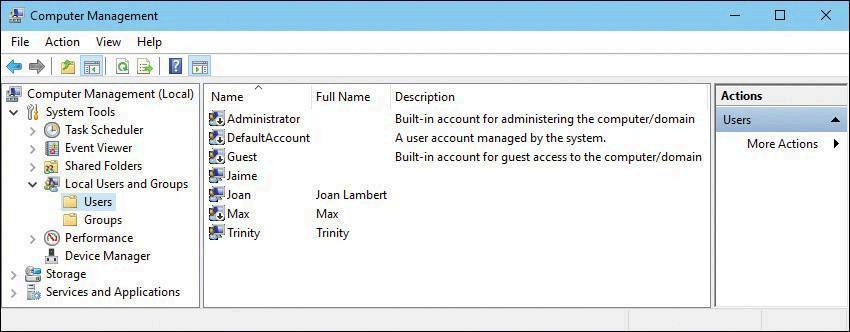

## 1. Usuarios, grupos y permisos en Windows

Antes de trabajar con un dispositivo con Windows 10, debes iniciar sesión con una **cuenta autorizada**. Las cuentas de usuario son esenciales para la seguridad de Windows y para ofrecer una experiencia personalizada.

### Tipos de cuentas en Windows

1. **Cuenta local**  
   - Credenciales y datos almacenados en el equipo.
   - No requiere un correo electrónico.
  
2. **Cuenta de Microsoft**  
   - Proporciona autenticación y sincronización entre dispositivos.
   - Se puede usar un correo de cualquier proveedor para crearla.

3. **Cuenta de Azure Active Directory**  
   - Para empresas y centros educativos.
   - Ofrece autenticación multifactor y acceso a servicios en línea.

### Gestión de cuentas

- Usa **Configuración > Cuentas** para administrar cuentas.
- También puedes usar el **Panel de control clásico**.

### Cuentas locales predeterminadas
- **Administrador:** no se puede eliminar y está deshabilitada por defecto.
- **Invitado:** permite accesos temporales, pero está deshabilitada por defecto.

### Gestión de grupos locales

:::tip[Administrador de equipos]
* **Win+R** y pega **compmgmt.msc** para ejecutar desde consola de administración de equipos 
* **Win+X** Abre el menú de administración rápida: seleccionar "Administración de equipos"
:::

### Grupos predeterminados en Windows 10
- **Administradores:** tienen control total sobre el sistema.
- **Usuarios:** cuentas estándar con acceso limitado.

Puedes gestionar los grupos locales desde la **Consola de administración de equipos**.

## 2. Gestión de permisos de archivos y carpetas

Los permisos son esenciales para autorizar usuarios a acceder a recursos en un equipo. 

### 1. Tipos de permisos
- **Explícitos:** Son aquellos que se establecen por defecto cuando se crea el recurso o mediante una acción del usuario.
- **Heredados:** son aquellos que se propagan a un recurso secundario desde un recurso principal. Por defecto, los recursos heredan los permisos de su contenedor cuando se crean.

### 2. Otorgar y denegar permisos
- Los propietarios pueden conceder permisos a usuarios o grupos.
- Los permisos no concedidos explícitamente se deniegan implícitamente.

Evita el uso de denegaciones explícitas, ya que aumenta la complejidad y puede causar errores.

### 3. Conflictos de Permisos
En Windows, cuando hay conflictos de permisos, se siguen estas reglas estrictas:
 * **Denegar siempre gana:** Si perteneces a un grupo con permiso de "Lectura", pero a tu usuario específico le pusieron "Denegar lectura", no entrarás. El "Denegar" es atómico.
 * **Permisos Explícitos vs. Heredados:** Un permiso que tú pongas directamente en un archivo ("Explícito") manda sobre el que el archivo recibe de la carpeta padre ("Heredado").
 * **Acumulación:** Si el grupo "Ventas" tiene Lectura y el grupo "Marketing" tiene Escritura, y tú estás en ambos, tienes Lectura + Escritura.
### 4. NTFS vs. Permisos de Compartición
 * Permisos de Compartición: Solo actúan cuando entras por la red (ej. \\Servidor\Carpeta). Suelen ser muy básicos (Leer, Cambiar, Control Total).
 * Permisos NTFS: Actúan siempre, estés sentado frente al PC o entres por red.

:::tip[Dato]
 * Cuando accedes por red, Windows aplica el más restrictivo de los dos. Si en red tienes "Control Total" pero en NTFS tienes "Solo lectura", el resultado final es Solo lectura.
 * Siempre configura primero los permisos NTFS y luego los de Compartición.
:::

#### Opciones Avanzadas

En la ventana de permisos avanzados, puedes:
 * Ver y modificar la lista completa de permisos.
 * Cambiar el propietario del archivo o carpeta.
 * Auditar accesos (quién accedió y qué hizo).
 * Deshabilitar la herencia de permisos para personalizar los permisos de un archivo o carpeta.
  
:::caution[actividad]
* Gestión de usuarios y grupos
* Gestión de permisos de archivos y carpetas
:::