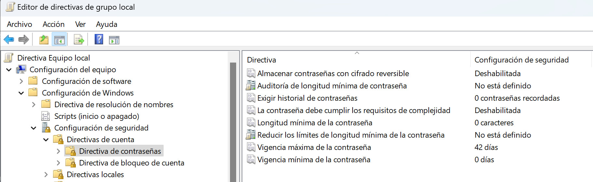
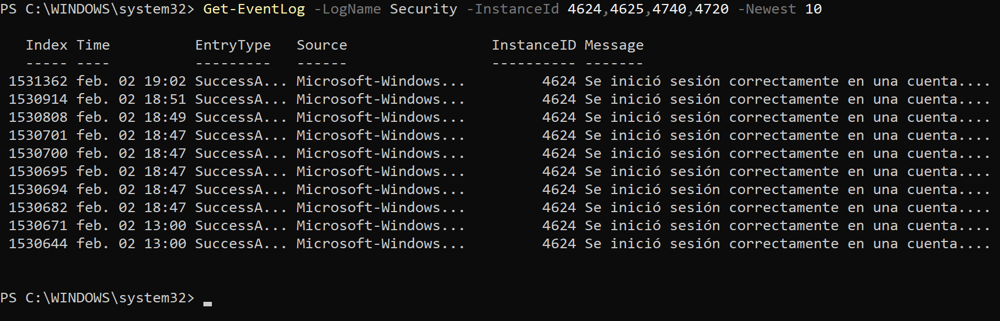

## Seguridad en Windows

:::tip[Editor de Directivas de Grupo Local]
   - `Win + R`: escribe `gpedit.msc`
:::

1. **Navega a las Directivas de Contraseña**:  
   `Configuración del equipo > Configuración de Windows > Configuración de seguridad > Directivas de cuenta > Directivas de contraseña`  




### Política de Cuentas y Contraseñas en Windows

| **Elemento**               | **Descripción**                                                                                                                                                  |
|----------------------------|------------------------------------------------------------------------------------------------------------------------------------------------------------------|
| **Complejidad de Contraseña** | Se requiere que las contraseñas contengan una combinación de letras mayúsculas, minúsculas, números y caracteres especiales.                                    |
| **Longitud Mínima**         | Generalmente, las contraseñas deben tener al menos **8 caracteres**, aunque se recomienda que sean más largas para mayor seguridad.                          |
| **Caducidad**              | Las contraseñas deben renovarse periódicamente, típicamente cada **60 a 90 días**, para mitigar riesgos de seguridad.                                           |
| **Bloqueo de Cuenta**      | Después de un número específico de intentos fallidos de inicio de sesión (normalmente **3 a 10**), la cuenta se bloquea por un período determinado.             |
| **Historial de Contraseñas** | Se puede configurar para que las nuevas contraseñas no sean idénticas a las anteriores, restringiendo el uso de las últimas **5 a 10** contraseñas anteriores.  |
| **Requerimiento de Autenticación** | Puede configurarse para utilizar métodos adicionales de autenticación, como la autenticación de dos factores (2FA) para mejorar la seguridad.                       |

### Políticas de Administración de Cuentas

| **Política**                            | **Descripción**                                                                                                                                                  |
|-----------------------------------------|------------------------------------------------------------------------------------------------------------------------------------------------------------------|
| **Acceso a la Cuenta**                 | Controla quién puede acceder a las cuentas de usuario, permitiendo o restringiendo el acceso según grupos o roles específicos.                                    |
| **Políticas de Auditoría**             | Establece qué eventos deben ser registrados (por ejemplo, inicios de sesión exitosos y fallidos) para monitorear actividades y detectar comportamientos sospechosos. |

### Políticas de Seguridad del Sistema

| **Política**                            | **Descripción**                                                                                                                                                  |
|-----------------------------------------|------------------------------------------------------------------------------------------------------------------------------------------------------------------|
| **Firewall de Windows**                 | Define reglas sobre qué aplicaciones o servicios pueden comunicar a través de la red, estableciendo una barrera de seguridad.                                  |
| **Control de Acceso**                   | Establece permisos sobre quién puede acceder a archivos, carpetas y recursos del sistema, asegurando que solo los usuarios autorizados tengan acceso.            |

### Políticas de Configuración del Sistema

| **Política**                            | **Descripción**                                                                                                                                                  |
|-----------------------------------------|------------------------------------------------------------------------------------------------------------------------------------------------------------------|
| **Actualizaciones Automáticas**         | Configura la instalación automática de actualizaciones de seguridad y del sistema operativo para garantizar que todos los sistemas estén al día.                 |
| **Política de Inicio de Sesión**       | Define parámetros sobre cómo los usuarios inician sesión y qué configuraciones están disponibles en sus perfiles.                                                |

### Políticas de Uso de Recursos

| **Política**                            | **Descripción**                                                                                                                                                  |
|-----------------------------------------|------------------------------------------------------------------------------------------------------------------------------------------------------------------|
| **Uso de Aplicaciones**                 | Controla qué aplicaciones pueden ser instaladas y ejecutadas en el sistema, limitando el uso de software no autorizado.                                          |
| **Restricciones de Hardware**           | Permite la configuración de dispositivos de hardware que pueden ser utilizados, eliminando riesgos de seguridad de dispositivos no autorizados.                 |

### Visor de Eventos

##### Modo gráfico
  ```powershell
  // Visor gráfico de eventos en Windows
  eventvwr.msc
  ``` 
| **Ubicación**                  | **Descripción**                                                                                             |
|-------------------------------|-------------------------------------------------------------------------------------------------------------|
| **Registro de Seguridad**     | Aquí se registran los eventos de inicio y cierre de sesión, así como intentos fallidos y cambios en las cuentas de usuario.                                                  |
| **Registro de Aplicación y Sistema** | Se registran eventos relacionados con aplicaciones y el sistema operativo, que también pueden incluir advertencias y errores relacionados con la autenticación.         |

##### Tipos de Eventos Relevantes

- **4624**: Inicio de sesión exitoso.
- **4625**: Intento de inicio de sesión fallido.
- **4740**: Bloqueo de cuenta.
- **4720**: Creación de una nueva cuenta de usuario.


##### Modo línea de comandos
```powershell
// eventos específicos usando PowerShell:
Get-WinEvent -LogName 'Security' | Where-Object { $_.Id -eq 4624 }
Get-EventLog -LogName Security -InstanceId 4624,4625,4740,4720 -Newest 10
```



:::caution[actividad]
  GPOs de seguridad
:::