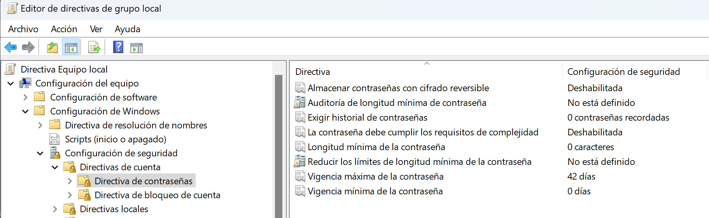
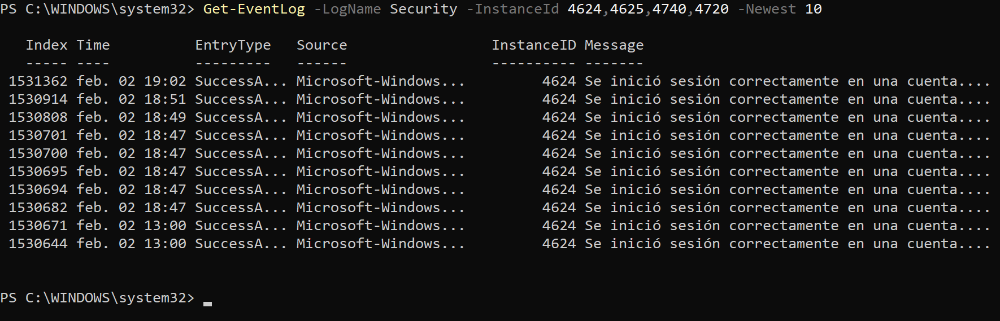

## Seguridad en Windows

:::tip[Editor de Directivas de Grupo Local]
   - `Win + R`: escribe `gpedit.msc`
:::

1. **Navega a las Directivas de Contraseña**:  
   `Configuración del equipo > Configuración de Windows > Configuración de seguridad > Directivas de cuenta > Directivas de contraseña`  



### Visor de Eventos

##### Modo gráfico
  ```powershell
  // Visor gráfico de eventos en Windows
  eventvwr.msc
  ``` 
| **Ubicación**                  | **Descripción**                                                                                             |
|-------------------------------|-------------------------------------------------------------------------------------------------------------|
| **Registro de Seguridad**     | Aquí se registran los eventos de inicio y cierre de sesión, así como intentos fallidos y cambios en las cuentas de usuario.                                                  |
| **Registro de Aplicación y Sistema** | Se registran eventos relacionados con aplicaciones y el sistema operativo, que también pueden incluir advertencias y errores relacionados con la autenticación.         |

##### Tipos de Eventos Relevantes

- **4624**: Inicio de sesión exitoso.
- **4625**: Intento de inicio de sesión fallido.
- **4740**: Bloqueo de cuenta.
- **4720**: Creación de una nueva cuenta de usuario.


##### Modo línea de comandos
```powershell
// eventos específicos usando PowerShell:
Get-WinEvent -LogName 'Security' | Where-Object { $_.Id -eq 4624 }
Get-EventLog -LogName Security -InstanceId 4624,4625,4740,4720 -Newest 10
```



:::caution[actividad]
  GPOs de seguridad
:::