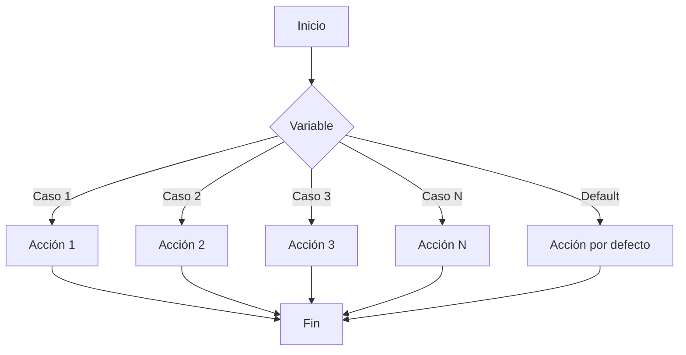

La instrucción **case** equivale a una estructura de if/else anidada. Comprobamos el valor de la condición y en función de ese valor hacemos una cosa u otra. (Se utiliza sobre todo para hacer menús.)


```bash
#!/bin/bash
case $var in
valor-1)
  instrucciones;;  
valor-2)
  instrucciones;;
…  
valor-n)
  instrucciones;;
*)
  instrucciones;;
esac
```
:::note[Aclaraciones]
- Cada opción debe ir finalizada por paréntesis ")".
- La última instrucción de cada opción se termina con ;; para indicar que ha terminado.
- Con el metacaracter "*" conseguimos que coincida cualquier cosa, por lo que siempre se cumplirá la condición. El * equivale al "else" del "if". Si no se pulsa ninguna opción correcta, entonces se ejecuta el *. 
- Se debe usar "esac" para finalizar la estructura. 
- Si las opciones que ponemos son letras, las tenemos que poner entre comillas "A")
:::


### Ejemplo 1

```bash
#!/bin/bash
echo "1. Eliminar fichero"
echo "2. Copiar fichero"
echo "3. Exit"
read –p "selecciona una opción" opc
case $opc in
1)
  echo "fichero eliminado";;
2)
  echo "fichero copiado";;
3)
  echo "adiós";; 
*)
  echo "esa opción no es correcta, adiós";;
esac
```

### Ejemplo 2 - Avanzado

```bash
#!/bin/bash
case $nombre in
"pepito")
  echo "Hola pepito";;
"Salva")
  echo "Hola Salva";;
"alberto" | "pepe")
  echo "tu nombre es $nombre"
  echo "Bienvenido";;&
[aA]*)
  echo "Tu nombre empieza por A";;
*)
  echo "¿Quién eres tú?"
  echo "adios";;
esac
```
:::note[Aclaraciones]
- Podemos hacer uso de | para integrar dos opciones posibles, tanto si marcas una como otra se ejecutarán las mismas instrucciones
- Podemos ejecutar varias órdenes en cada opción. Los ;; solo se pondrán al final de la última instrucción de esa opción.
- uso de “;;&” estamos indicando que siga comprobando el resto de opciones
:::
