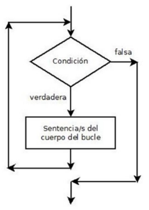

Un bucle **While** en bash es una estructura de control (de repetición). _Las instrucciones se ejecutarán  mientras se cumpla la  expresión._


```bash
#!/bin/bash
while [ expresión ]
do
  instrucciones
done
```

### Ejemplo 1 - Bucle infinito

```bash
#!/bin/bash
while [ true ] 
do
  echo "BUCLE INFINITO"
done
```

### Ejemplo 2

```bash
#!/bin/bash
read -p "Introduce un número: " num
while [ $num -ne 0 ]
do
  echo "El número elegido no es 0" 
  read -p "Introduce un número: " num
done
```