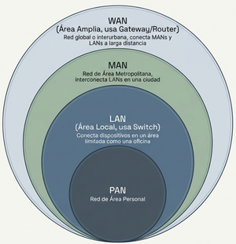

## 1. Tipos de redes

En su forma más básica, una **red** consiste en computadoras conectadas entre sí para intercambiar información. Estas conexiones pueden realizarse mediante **cables o de forma inalámbrica**.

#### Clasificación de Redes según su Alcance
| Tipo de Red | Descripción                                                                 |
|-------------|-----------------------------------------------------------------------------|
| **PAN**     | **Red de Área Personal**: Red de corto alcance utilizada para conectar dispositivos personales (ej. teléfonos, computadoras, tablets). Generalmente se utiliza para compartir información entre dispositivos cercanos. |
| **LAN**     | **Red de Área Local**: Conecta dispositivos dentro de un área geográfica limitada, como una oficina o un hogar. Permite la comunicación y el intercambio de recursos entre equipos cercanos. |
| **MAN**     | **Red de Área Metropolitana**: Cubre una área más amplia que una LAN, como una ciudad. Se utiliza para conectar múltiples LANs dentro de una misma área geográfica. |
| **WAN**     | **Red de Área Amplia**: Conecta redes que están geográficamente dispersas, a menudo en diferentes ciudades o países. Es utilizada por organizaciones grandes para interconectar sus distintas sedes. |
| **VPN**     | **Red Privada Virtual**: Proporciona una conexión segura y encriptada sobre una red pública, permitiendo a los usuarios acceder a recursos como si estuvieran en una red local. |



## 2. Redes de área local cableadas

Una **LAN cableada** conecta los dispositivos de un mismo espacio físico mediante cables de red. Es la opción más habitual en entornos profesionales por su estabilidad y velocidad.

### Tipos de cable

| Tipo | Velocidad máx. | Distancia máx. | Uso habitual |
|------|---------------|---------------|-------------|
| **Cat 5e** | 1 Gbps | 100 m | Instalaciones domésticas o de bajo coste |
| **Cat 6** | 10 Gbps | 55 m (a 10G) / 100 m (a 1G) | Oficinas y centros de datos |
| **Cat 6A** | 10 Gbps | 100 m | Infraestructuras empresariales |
| **Fibra óptica** | 100 Gbps+ | Km (depende del tipo) | Conexión entre edificios o CPDs |

El conector estándar para cable de cobre es el **RJ-45**. Existen dos estándares de crimpado: **T-568A** y **T-568B**; en una misma instalación hay que usar siempre el mismo.

### Topología en estrella

La topología dominante en redes locales modernas es la **estrella**: todos los equipos se conectan a un **switch** central.

```
   PC-A ──┐
   PC-B ──┤── [Switch] ── [Router] ── Internet
   PC-C ──┘
```

El switch trabaja en **capa 2** (MAC) y reenvía las tramas solo al puerto destino, evitando colisiones y mejorando el rendimiento respecto al hub.

:::tip[5.1 Redes cableadas]
[Network Cables - PowerCert Animated Videos](https://www.youtube.com/watch?v=_NX99ad2FUA)
:::

## 3. Subredes (Subnetting)
Una **subred** es simplemente una división de una red más grande. Una empresa puede decidir dividir su única LAN en redes más pequeñas para separar, por ejemplo, los datos del departamento de ventas de los del departamento de servicio.

*   **El Enrutador (Router):** Es el dispositivo que divide o separa una red de otra, actuando como la entrada o puerta de acceso a cada subred.
*   **Flexibilidad:** Una organización puede crear tantas subredes como necesite dependiendo de sus requerimientos de expansión.

#### ¿Por qué crear subredes?
La segmentación de una red en subredes ofrece tres beneficios críticos para la administración de sistemas:

1.  **Manejabilidad:** Es más sencillo identificar y solucionar problemas técnicos en redes pequeñas que en una sola red masiva.
2.  **Seguridad:** Permite aplicar **reglas de seguridad independientes** para cada subred, controlando quién tiene acceso a qué datos y evitando que departamentos no autorizados vean tráfico ajeno.
3.  **Rendimiento:** Mejora el desempeño al controlar el **tráfico de difusión (broadcast)**. En una red, las transmisiones enviadas por un equipo suelen ser escuchadas por todos los demás; al usar subredes, dichas transmisiones se limitan solo a los equipos dentro de la misma división, reduciendo el tráfico innecesario.

#### Resumen de Infraestructura
| Concepto | Dispositivo Clave | Alcance |
| :--- | :--- | :--- |
| **LAN** | Switch (Conmutador) | Privado, local (edificio) |
| **WAN** | Gateway / Router | Global (Internet) |
| **Subred** | Router (Enrutador) | División lógica de una LAN |


:::tip[5.1.2. Tipos de redes]
[Tipos de redes - PowerCert Animated Videos](https://www.youtube.com/watch?v=NyZWSvSj8ek)
:::
