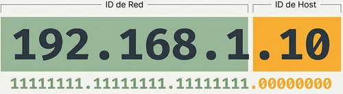
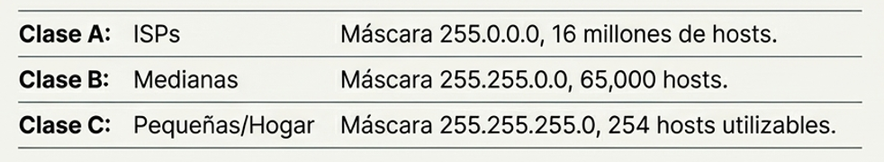

## 1. Fundamentos de la Dirección IP
Para entender la máscara de subred, primero se debe comprender la **dirección IPv4**. Esta es un identificador numérico de **32 bits** para dispositivos en una red, compuesto por cuatro grupos de números llamados **octetos** (rango de 0 a 255),.

Toda dirección IP consta de dos componentes esenciales:
*   **ID de Red:** Identifica la red específica a la que pertenece el dispositivo.
*   **ID de Host:** Identifica al dispositivo individual (computadora, servidor, etc.) dentro de esa red.

## 2. ¿Qué es la Máscara de Subred?
Es un número que se asemeja a una dirección IP y su función principal es **revelar qué parte de la dirección IP pertenece a la red y qué parte al host**. Lo hace "enmascarando" la sección de red.

### El funcionamiento binario
*   **Los "1" en la máscara de subred** indican la porción de la dirección IP que define la **red**,.
*   **Los "0" en la máscara de subred** indican la porción destinada a los **hosts**.

## 3. Clases de Direcciones IP
Las direcciones y máscaras se categorizan según las necesidades de la organización,:

| Clase | Uso Típico | Capacidad de Hosts |
| :--- | :--- | :--- |
| **Clase A** | Grandes organizaciones (ej. ISPs) | Hasta 16 millones, |
| **Clase B** | Organizaciones medianas a grandes | Hasta 65,000 |
| **Clase C** | Pequeñas empresas y hogares | 254 hosts utilizables |

## 4. Notación CIDR
La notación **CIDR** (Enrutamiento entre Dominios sin Clases), o **notación de barra**, es una forma abreviada de escribir la máscara de subred,. Consiste en una barra diagonal seguida del número de bits "1" que tiene la máscara.
*   Ejemplo: **/24** significa que la máscara tiene 24 bits activados (equivalente a 255.255.255.0).

:::tip[5.2.1 Dirección IP y máscara de subred]
[Dirección IP y máscara de subred - PowerCert Animated Videos](https://www.youtube.com/watch?v=s_Ntt6eTn94)
:::