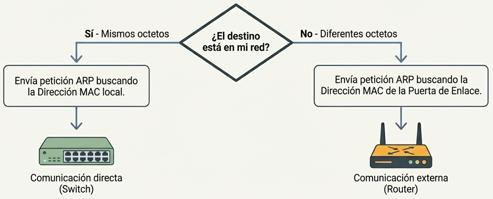

## 1. ¿Qué es una Puerta de Enlace Predeterminada?
En términos sencillos, es un dispositivo que **reenvía datos de una red a otra**. Actúa como el punto de acceso o "puerta de salida" para que los dispositivos de una red local puedan comunicarse con dispositivos en redes externas, como Internet.

*   **Dispositivo habitual:** La mayoría de las veces, este rol lo desempeña un **enrutador (router)**.
*   **Significado de "Predeterminada":** Se refiere a que este dispositivo es la **primera opción** que considera el equipo cuando los datos necesitan salir de su propia red.
*   **Verificación:** En sistemas Windows, se puede consultar la dirección de la puerta de enlace asignada mediante el comando `ipconfig` en el símbolo del sistema.

## 2. Comunicación Local vs. Comunicación Externa
El comportamiento de los datos varía dependiendo del destino:

*   **Red Local (Misma red):** Si las computadoras están en la misma red, se comunican directamente a través de un **conmutador (switch)**. Los datos no necesitan pasar por la puerta de enlace predeterminada.
*   **Redes Diferentes:** Para acceder a una red distinta (por ejemplo, cargar una página web), los datos deben pasar obligatoriamente por la puerta de enlace (el router), que se encarga de enviarlos a su destino fuera de la red local.

## 3. ¿Cómo sabe el equipo cuándo usar la Puerta de Enlace?
Para determinar si un destino es local o externo, el dispositivo utiliza la **dirección IP** y la **máscara de subred**.

1.  **Análisis de bits:** La máscara de subred revela qué parte de la dirección IP identifica a la red y qué parte al host.
2.  **Comparación:** El equipo compara su propia porción de red con la de la dirección IP de destino.
    *   Si los octetos de red coinciden (ej. ambos empiezan con 192.168.0), están en la **misma red**.
    *   Si los octetos de red son diferentes, el equipo detecta que el destino está en una **red diferente**.

#### Ejemplo

Supón que tu equipo tiene la IP `192.168.1.10` con máscara `255.255.255.0` (`/24`). La porción de red es `192.168.1`.

| Destino | IP destino | Porción de red | ¿Misma red? | Ruta |
|---|---|---|---|---|
| Otro PC de tu casa | `192.168.1.25` | `192.168.1` | ✅ Sí | Directo por el switch |
| Servidor de Google | `142.250.184.14` | `142.250.184` | ❌ No | A través del router (gateway) |
| Tu impresora de red | `192.168.1.50` | `192.168.1` | ✅ Sí | Directo por el switch |
| Página web externa | `93.184.216.34` | `93.184.216` | ❌ No | A través del router (gateway) |

<div class="d2-gateway-container">

```d2
direction: up

internet: Internet\n(142.x, 93.x, ...) {
  shape: cloud
}

red_local: Red local (192.168.1.0/24) {
  style.fill: transparent
  style.stroke-dash: 5
  
  pc: PC\n192.168.1.10
  impresora: Impresora\n192.168.1.50
  portatil: Portátil\n192.168.1.20
  
  switch: Switch {
    shape: rectangle
  }
  
  router: Router / Gateway\nLAN: 192.168.1.1 {
    shape: cylinder
  }

  pc <-> switch
  impresora <-> switch
  portatil <-> switch
  switch <-> router
}

red_local.router <-> internet: Solo tráfico externo
```

</div>

## 4. El proceso de comunicación y ARP
El protocolo **ARP (Address Resolution Protocol)** es fundamental en este proceso:

*   **Si el destino es local:** La computadora envía una transmisión ARP solicitando la **dirección MAC** del equipo de destino para hablar directamente con él.
*   **Si el destino es externo:** La computadora no pide la MAC del equipo remoto (ya que las transmisiones ARP no pueden atravesar un enrutador), sino que solicita la **dirección MAC de la puerta de enlace predeterminada**.
*   **Entrega:** Una vez obtenida la dirección MAC del router, el equipo le envía los datos a él, y el router se encarga de retransmitirlos hacia la red de destino.
*   

  
:::tip[5.2.2. Puerta de enlace predeterminada - Default gateway]
[Default gateway - PowerCert Animated Videos](https://www.youtube.com/watch?v=pCcJFdYNamc)
:::