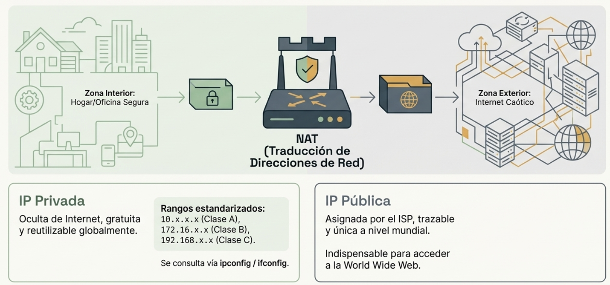

### Definición de Dirección IP
Una dirección IP es un **identificador numérico** asignado a cada computadora o dispositivo dentro de una red para permitir la comunicación entre ellos. En el estándar IPv4, existen dos tipos principales que cumplen funciones distintas: las públicas y las privadas.

### Direcciones IP Públicas
Estas direcciones son asignadas por un **Proveedor de Servicios de Internet (ISP)** al módem o enrutador de una casa o empresa. Son **únicas a nivel mundial**, lo que significa que no existen duplicados, y están registradas oficialmente en Internet para proporcionar acceso a la red global. Sin una dirección IP pública, es imposible acceder a la World Wide Web. Debido a que se utilizan externamente y son rastreables, se consideran menos seguras y suelen requerir medidas adicionales como VPNs o proxies para proteger la privacidad del usuario.

### Direcciones IP Privadas
Surgieron como una solución ante la escasez de las más de 4 mil millones de direcciones IPv4 disponibles, ya que los ingenieros no previeron el crecimiento masivo de Internet. A diferencia de las públicas, las **IP privadas no se registran en Internet** y solo se utilizan internamente dentro de una red local, como un hogar o negocio. Son asignadas automáticamente por el servicio **DHCP** del enrutador y son gratuitas. Una característica clave es que no son únicas a nivel global; la misma dirección privada puede ser utilizada simultáneamente en millones de redes locales diferentes alrededor del mundo.

### El Rol de NAT (Traducción de Direcciones de Red)
Dado que las direcciones privadas no pueden acceder directamente a Internet, el enrutador utiliza un servicio llamado **NAT**. NAT traduce la dirección IP privada del dispositivo interno a la única dirección IP pública de la red cuando se requiere enviar datos hacia afuera, y realiza el proceso inverso cuando la información regresa de Internet hacia la computadora específica en la red local.

### Clasificación de las IP Privadas
Las direcciones privadas se dividen en tres rangos o clases según el tamaño de la organización:
*   **Clase A:** Comienza con el número 10 y se utiliza generalmente en organizaciones de gran tamaño.
*   **Clase B:** Comienza con 172 y es típica de organizaciones medianas.
*   **Clase C:** Comienza con **192.168**; es el rango más popular y el que se encuentra comúnmente en hogares y pequeñas empresas.

### Identificación y Seguridad
Para conocer la dirección IP privada en Windows se utiliza el comando `ipconfig`, mientras que en Mac o Linux se emplea `ifconfig`. Para conocer la dirección pública, es necesario acceder a sitios web externos como *whatsmyipaddress.com*. En términos de seguridad, las IP privadas son intrínsecamente más seguras al estar ocultas del tráfico externo de Internet, aunque al navegar, la IP pública sigue quedando expuesta, por lo que se recomienda el uso de herramientas de privacidad adicionales.

:::tip[5.2.3. Public & Private IP]
[Public & private IP](https://www.youtube.com/watch?v=po8ZFG0Xc4Q)
:::