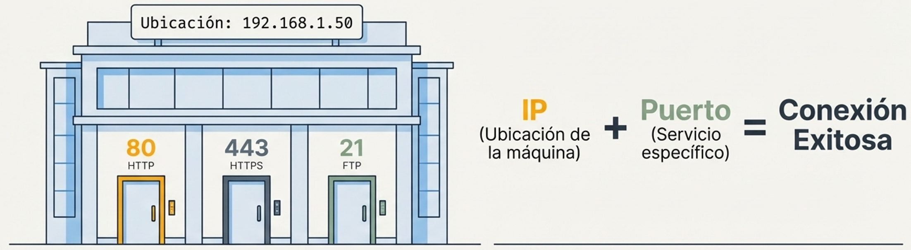
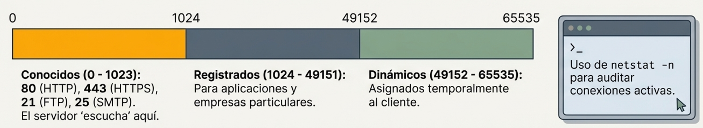

### ¿Qué es un Puerto?
- **Conexión lógica** (no física) que usan los programas y servicios para intercambiar información.
- Determina qué servicio concreto se quiere usar en un servidor (web, correo, FTP...).
- Se identifica con un número único del **0 al 65535**.

### Relación entre Dirección IP y Puerto
- La **IP** localiza el dispositivo o servidor en la red.
- El **puerto** identifica el servicio específico dentro de ese servidor.
- Trabajan en conjunto: la IP lleva el paquete al servidor y el puerto lo dirige al programa correcto.

### Categorías de Puertos

| Categoría | Rango | Uso |
|-----------|-------|-----|
| **Conocidos** *(Well-known)* | 0 – 1023 | Servicios estándar: `80` HTTP, `443` HTTPS, `21` FTP, `25` SMTP |
| **Registrados** | 1024 – 49151 | Registrados por empresas/desarrolladores: `1433` SQL Server (Microsoft), `3306` MySQL (Oracle), `3389` RDP (Microsoft), `5432` PostgreSQL, `8080` HTTP alternativo (Tomcat/Jenkins), `27017` MongoDB |
| **Dinámicos / Privados** | 49152 – 65535 | Usados temporalmente por el cliente al iniciar una conexión |

### Herramientas de Visualización
- `netstat -n` / `netstat -an` — muestra las conexiones activas con IPs y puertos numéricos.
- Permite ver la IP local con su puerto dinámico y la IP del servidor remoto con su puerto de servicio.

:::tip[5.2.4. Puertos]
[Ports - PowerCert Animated Videos](https://www.youtube.com/watch?v=g2fT-g9PX9o)
:::
