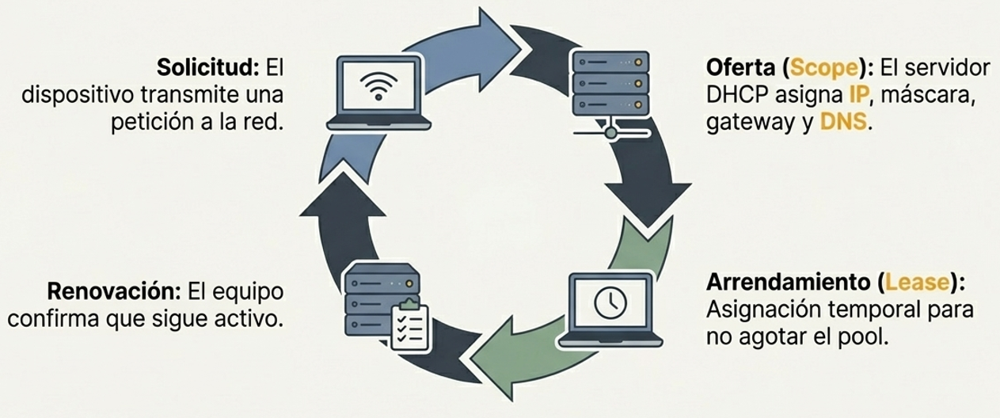

### Conceptos Básicos de Asignación de IP
Cada dispositivo en una red requiere una dirección IP para comunicarse. Existen dos métodos para asignar estas direcciones: la **IP estática**, donde un usuario ingresa manualmente la dirección IP, la máscara de subred, la puerta de enlace y el servidor DNS; y la **IP dinámica**, donde el proceso es automático. El método estático, aunque fue el original, resulta laborioso en redes grandes y conlleva el riesgo de **conflictos de IP** si se asigna la misma dirección a dos dispositivos diferentes.

### Funcionamiento del DHCP
El DHCP es la solución para automatizar la configuración de red. Cuando una computadora está configurada para obtener una dirección IP automáticamente, esta transmite una solicitud a la red. Un **servidor DHCP** recibe la solicitud y asigna una dirección IP de su grupo disponible, entregando también la máscara de subred, la puerta de enlace predeterminada y los servidores DNS. En sistemas Windows, se puede verificar esta configuración automática utilizando el comando `ipconfig /all`.

### El Alcance (Scope) y el Proceso de Arrendamiento
El servidor DHCP gestiona un **alcance (scope)**, que es un rango de direcciones IP personalizable que el administrador define para su distribución. Es importante destacar que las computadoras no son "dueñas" de las direcciones IP, sino que las reciben bajo un **arrendamiento (lease)**. Este arrendamiento tiene una duración determinada (por ejemplo, un día) para evitar que el servidor se quede sin direcciones disponibles si los equipos se retiran de la red sin informar.

### Renovación y Gestión de Direcciones
Para mantener su dirección, los equipos envían una señal al servidor para **renovar el arrendamiento**, confirmando que siguen presentes en la red. Si una computadora se desconecta y no solicita la renovación, el arrendamiento vence y la dirección IP regresa al grupo (pool) para ser utilizada por otro dispositivo. Este sistema garantiza que las direcciones IP se utilicen de manera eficiente y no queden ocupadas permanentemente por dispositivos inactivos.

### Reservas de IP
Existen casos donde se requiere que un dispositivo mantenga siempre la misma dirección IP sin que esta cambie nunca. Para esto se crean **reservas**, donde el servidor DHCP reconoce la **dirección MAC** específica de un equipo y le asigna siempre la misma IP predefinida. Estas reservas no suelen usarse para computadoras normales, sino para dispositivos especiales como **impresoras de red, servidores y enrutadores**.

### Implementación del Servicio
El DHCP es un servicio que puede ejecutarse en servidores dedicados (como Microsoft o Linux), pero también es una función integrada en la gran mayoría de los **enrutadores (routers)**, ya sean para uso doméstico, pequeñas oficinas o entornos empresariales.

:::tip[5.3.1. Protocolo de configuración dinámica de host (DHCP)]
[DHCP - PowerCert Animated Videos](https://www.youtube.com/watch?v=e6-TaH5bkjo)
:::