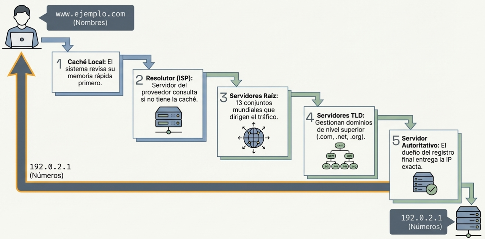

import { Steps } from '@astrojs/starlight/components';

### El Propósito del DNS: Nombres frente a Números
- Las computadoras se identifican con **direcciones IP** (números), pero los humanos usamos nombres.
- El **DNS (Domain Name System)** traduce nombres de dominio (`google.com`) a IPs (`142.250.184.14`).
- Sin DNS habría que memorizar la IP de cada sitio web.

### El DNS como una agenda telefónica
- Funciona como una **agenda telefónica**: buscas el nombre y obtienes el número.
- Al escribir un dominio en el navegador, el DNS busca en su base de datos la IP correspondiente.
- Con la IP resuelta, el navegador ya puede conectarse al servidor web.

### El Servidor de Resolución (Resolver)
- Si la IP no está en la **caché local** del sistema, se consulta al **servidor resolver** (habitualmente el del ISP).
- El resolver comprueba su propia caché y, si no tiene respuesta, consulta la jerarquía DNS.

### La Jerarquía de Servidores: Raíz, TLD y Autorizados

| Nivel | Nombre | Función |
|-------|--------|---------|
| 1º | **Servidores Raíz** | 13 conjuntos mundiales; no conocen la IP final, dirigen al TLD correcto |
| 2º | **Servidores TLD** | Gestionan extensiones (`.com`, `.net`, `.org`); dirigen al servidor autorizado del dominio |
| 3º | **Servidores Autorizados** | Conocen la IP exacta del dominio y la devuelven al resolver |

#### Ejemplo: resolución de `www.google.com`

<Steps>

1. **El navegador consulta la caché local** — comprueba si ya conoce la IP de `www.google.com`. Si no la tiene, pasa al siguiente paso.

2. **El resolver del ISP recibe la consulta** — comprueba su propia caché. Si tampoco la tiene, inicia la búsqueda jerárquica.

3. **Consulta al servidor Raíz** — el resolver pregunta a uno de los 13 servidores raíz: *"¿quién gestiona `.com`?"*. El raíz responde con la dirección del servidor TLD de `.com`.

4. **Consulta al servidor TLD `.com`** — el resolver pregunta: *"¿quién es el autorizado para `google.com`?"*. El TLD responde con la dirección del servidor autorizado de Google.

5. **Consulta al servidor Autorizado de Google** — el resolver pregunta: *"¿cuál es la IP de `www.google.com`?"*. El servidor responde con la IP exacta: `142.250.184.14`.

6. **El resolver devuelve la IP al navegador** y la guarda en caché (según el TTL). El navegador ya puede conectarse al servidor web de Google.

</Steps>

### Optimización mediante Memoria Caché
- Una vez resuelta la IP, el resolver la **guarda en caché** durante un tiempo (TTL).
- Las siguientes consultas al mismo dominio se responden directamente desde la caché, sin recorrer toda la jerarquía.
- Esto reduce la latencia y el tráfico DNS de forma significativa.

:::tip[5.3.2. Sistema de nombres de dominio - DNS]
[DNS - PowerCert Animated Videos](https://www.youtube.com/watch?v=mpQZVYPuDGU)
:::