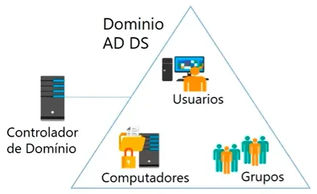

## Servicios de directorio (Directory Services)

Los servicios de directorio **almacenan información** sobre la organización, sitios, ordenadores, usuarios, objetos compartidos y cualquier otra cosa que pueda formar parte de la infraestructura de red. Los **elementos** del directorio activo pueden ser diferentes unos de otros (**usuarios, grupos, políticas de acceso, permisos, etc.**), por lo que la información almacenada variará según la naturaleza del objeto. Toda esta información se almacena en una **base de datos jerárquica**.

### Elementos
  - **Directorio**: es un repositorio único para la información relativa a los usuarios y recursos de una organización (objetos).
  - **Dominio**: colección de objetos dentro de un directorio y forman un subconjunto administrativo. Para poner nombre a los dominios se usa el protocolo DNS, por lo que es necesario al menos un servidor DNS, instalado en la red.
  - **Objeto**: Cualquiera de los componentes que forman parte del directorio. Pueden ser recursos, usuarios, relaciones de confianza, servidores, equipos, unidades organizativas, etc. 
En general, los objetos se organizan en tres categorías:
    - **Usuarios**: identificados a través del binomio nombre/contraseña y que se pueden organizar en grupos. 
    - **Recursos**: elementos a los que los usuarios pueden acceder, según sus privilegios,   para   desarrollar   su   actividad.   Pueden   ser   carpetas compartidas, impresoras, etc.
    - **Servicios**: funciones a las que los usuarios tienen acceso, como el correo electrónico, conexión a internet o copias de seguridad en la nube. 
  - **Unidad  Organizativa**:  es  un  contenedor  de  objetos  que  permite  organizarlos  en subconjuntos de forma jerárquica. De esta forma podemos establecer una estructura lógica que represente de forma adecuada a nuestra organización y simplifique la administración.
  -   **Grupos**: conjunto de objetos usuario. Al igual que las unidades organizativas, facilitan la organización y administración de los objetos, en este caso concreto, usuarios.
  -   **Controlador de dominio**: es el equipo que contiene la base de datos de objetos del directorio  para  un  determinado  dominio,  incluida  la  información  de  seguridad. Además será responsable de la autenticación de objetos dentro de su ámbito de control.

  
  ## DNS (Domain Name Server)
  
  Para  nombrar  a  todos  estos  objetos  que  componen  la  red,  los  servicios  de directorio definen un **espacio de nombres unívoco**, e identifican a cada uno de estos objetos con un nombre único en todo el directorio.

  La tecnología utilizada para crear este espacio de nombres es la DNS (**Domain Name Server**), y su funcionamiento es similar al de Internet. Cada uno de los objetos del directorio posee un DN (**Distinguished Name**) que lo identifica de forma unívoca del resto de elementos del directorio.

  Otro aspecto importante de los servicios de directorio, es que ofrecen una **capa de abstracción** para facilitar el acceso a los objetos. Se debe indicar una **única ubicación** en donde se dirigirán las peticiones de información. No importa si la información solicitada se encuentra o no en ese emplazamiento, el **servicio de directorio se encargará de las solicitudes** que le lleguen.
  

  :::danger[aclaración]
  **Active Directory** es un tipo específico de servicio de directorio. Mientras que el servicio de directorio es un concepto amplio que abarca cualquier sistema que gestione información de red, Active Directory es una implementación concreta de este concepto, diseñada por Microsoft para sus entornos de red.
  :::