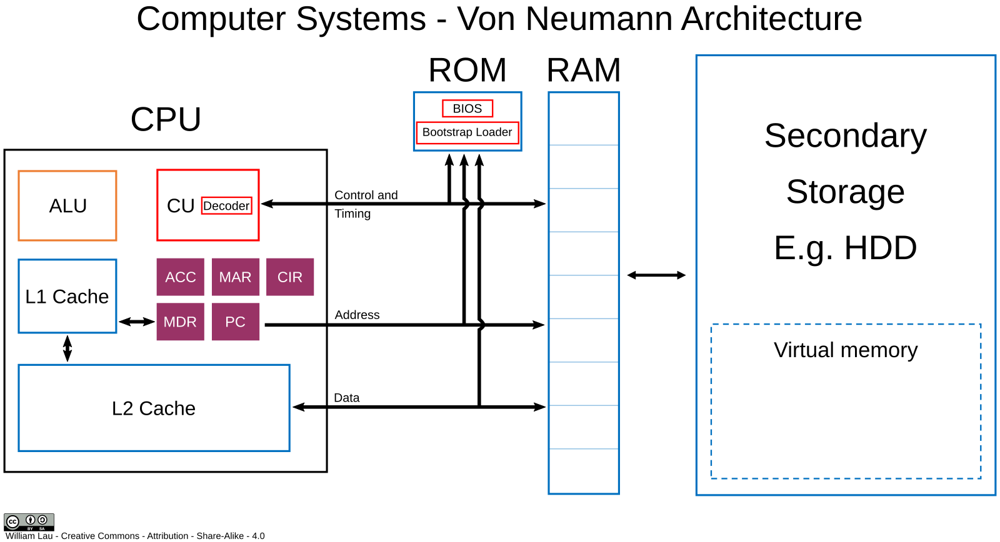

## Arquitectura

L'**arquitectura de von Neumann** és un model de disseny per a ordinadors proposat pel matemàtic John von Neumann en 1945. S'ha convertit en la base de quasi tots els sistemes informàtics moderns.

<!-- Imatge local guardada en src/assets/ -->
<!-- Utilitza una ruta de fitxer relativa o un àlies d'importació -->

### Components principals:
1. **Unitat Central de Processament (CPU)**:
   - Composta per la **Unitat de Control** (que coordina les operacions) i la **Unitat Aritmètico-Lògica (ALU)** (que realitza càlculs matemàtics i operacions lògiques).
   
2. **Memòria**:
   - Emmagatzema tant dades com instruccions (programes) en el mateix espai de memòria. Això és el que distingeix l'arquitectura de von Neumann d'altres, com la de Harvard, que separa les instruccions i les dades.

3. **Dispositius d'Entrada i Eixida (E/S)**:
   - Permeten la interacció del sistema amb l'exterior, facilitant l'entrada de dades i l'eixida de resultats processats.

4. **Bus de Dades**:
   - Un sistema de comunicació que transporta dades, adreces i senyals de control entre els diferents components.

### Funcionament bàsic:
- **Cicle de cerca i execució**: 
   1. La CPU cerca una instrucció en la memòria.
   2. Decodifica la instrucció.
   3. Executa la instrucció, ja siga realitzant càlculs o movent dades.
   4. Repeteix el cicle amb la següent instrucció.

### Característiques clau:
- **Emmagatzematge de programes**: En lloc de tindre instruccions fixes, els programes poden ser modificats i emmagatzemats juntament amb les dades en la memòria.
- **Secuencialitat**: Les instruccions són executades una darrere l'altra de manera seqüencial, la qual cosa permet controlar-les mitjançant un comptador de programa.

### Avantatges:
- Simplicitat en el disseny i operació del sistema.
- Flexibilitat en permetre que el mateix maquinari puga executar diferents programes.

### Desavantatges:
- **Coll de botella de von Neumann**: En compartir el mateix bus per a accedir tant a les dades com a les instruccions, pot haver-hi una limitació en el rendiment, ja que la CPU pot quedar esperant mentre accedeix a la memòria.
