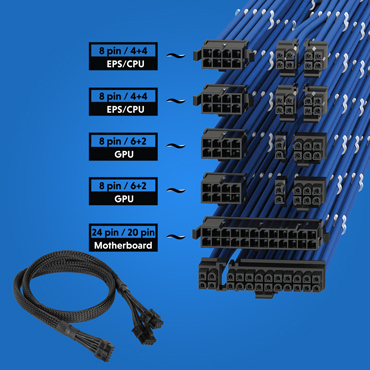

La **GPU** (Graphics Processing Unit) és el processador dedicat a gestionar i accelerar tasques gràfiques, com ara el processament d'imatges, vídeos i gràfics 3D. Tot i que la seua funció principal és renderitzar gràfics, també s'utilitza en altres tipus de processament paral·lel intensiu, com ara la intel·ligència artificial i la computació científica.

### Característiques clau d'una GPU:
1. **Arquitectura paral·lela**: A diferència de la CPU, dissenyada per processar poques tasques ràpidament, la GPU està optimitzada per executar milers de petites tasques de manera simultània, ideal per al renderitzat de gràfics.
2. **Memòria dedicada (VRAM)**: La majoria de GPUs tenen la seua pròpia memòria RAM (VRAM), que emmagatzema les dades gràfiques per a un accés ràpid. Les targetes d'alta gamma solen tindre més VRAM, millorant el seu rendiment en tasques d'alta demanda.
3. **Cores o nuclis CUDA/Stream**: Les GPUs tenen milers de nuclis més xicotets que els d'una CPU, cosa que els permet processar moltes operacions en paral·lel. En Nvidia es diuen nuclis **CUDA** i en AMD **Stream Processors**.
4. **Ús en gaming**: En els videojocs, les GPUs són responsables del renderitzat de gràfics complexos en temps real, com textures, ombres i llums.
5. **Ús en tasques de càlcul**: A més dels gràfics, les GPUs s'utilitzen per a tasques com ara **machine learning**, **mineria de criptomonedes** i **simulacions** científiques, ja que poden gestionar grans volums de dades en paral·lel de manera eficient.
6. **Ray Tracing**: Les GPUs modernes suporten tecnologies avançades com el **ray tracing**, que simula com la llum interactua amb els objectes, millorant la qualitat gràfica en jocs i aplicacions de disseny.

Hi ha diversos tipus de **memòria gràfica** que s'utilitzen en les **targetes gràfiques** (GPU). Aquestes memòries estan dissenyades per a emmagatzemar dades gràfiques com textures, models 3D, i realitzar tasques de renderitzat de manera ràpida i eficient.

### Principals tipus de memòria gràfica:

1. **VRAM (Video RAM)**:
   - És un tipus de memòria que es troba en les GPUs i està dedicada a l'emmagatzematge de dades gràfiques.
   - Funciona com un buffer entre la GPU i la pantalla, proporcionant accés ràpid a les dades visuals.

2. **GDDR (Graphics Double Data Rate)**:
   - És una variant de la memòria DDR, dissenyada específicament per a targetes gràfiques.
   - **Versions comunes**:
     - **GDDR6**: L'estàndard actual en moltes GPUs modernes, amb més rendiment i eficiència energètica que GDDR5.
     - **GDDR6X**: Utilitzada en algunes GPUs d'alta gamma, com la Nvidia RTX 3000, ofereix més velocitat i rendiment.

3. **HBM (High Bandwidth Memory)**:
   - És un tipus de memòria d'alt ample de banda i baixa latència, dissenyada per a GPUs d'alt rendiment.
   - **HBM2**: Versió millorada que ofereix encara més ample de banda, usada en GPUs d'estacions de treball i alguns models d'alta gamma com les sèries Radeon d'AMD.

4. **DDR/DDR2/DDR3/DDR4/DDR5/LPDDR (Low Power DDR)**:
   - En els processadors que incorporen la unitat gràfica, s'utilitza la del sistema.

### Connectors d'alimentació per a targetes gràfiques

1. **Connector PCIe de 6 pins**:
   - Proporciona fins a **75W**.
   - Utilitzat en targetes gràfiques de gamma mitjana.

2. **Connector PCIe de 8 pins**:
   - Proporciona fins a **150W**.
   - Comú en targetes gràfiques d'alta gamma.

3. **Connector PCIe de 12 pins**:
   - Introduït per Nvidia per a les RTX 3000.
   - Proporciona fins a **300W**.

4. **Connector PCIe de 16 pins (12+4 pins)**:
   - Utilitzat en GPUs recents com les RTX 4000.
   - Proporciona fins a **600W**.

:::caution[activitat]
Practicum II
:::
