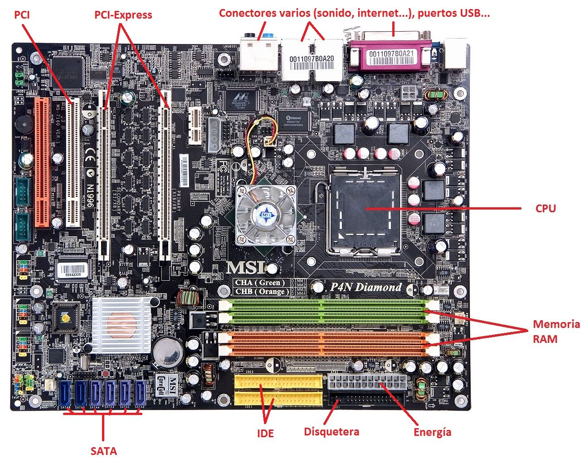
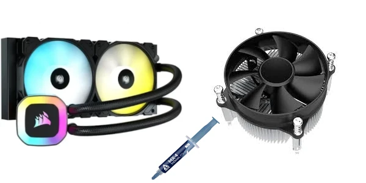
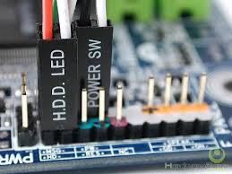
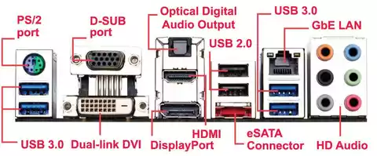
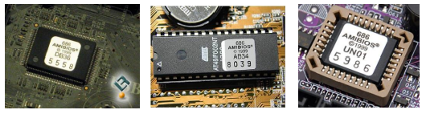

La placa base és un circuit imprés amb diferents formes estàndard, que permet que la resta dels components es connecten entre ells.

:::tip[Ampliació]
[circuit imprès (es)](https://fadesaing.com/circuitos-impresos/)
:::

## 1. Factor de forma d'una placa base 
Es refereix a les seues dimensions físiques, el disseny dels seus connectors i la disposició dels seus components. Determina quin tipus de carcassa o gabinet pot allotjar la placa, així com el tipus de components que es poden instal·lar. Els principals factors de forma per a plaques base són:

## 2. Components de la placa base

### Chipset

Conjunt de xips en la placa base que actua com un pont de comunicació entre el processador (CPU) i altres components de l'ordinador, com la memòria RAM, emmagatzematge, targetes gràfiques, ports USB i altres dispositius perifèrics.

### Socket

El sòcol on es col·loca el processador, permetent que la CPU es comunique amb la resta dels components del sistema a través de la placa base.

Cada processador està dissenyat per a un tipus específic de socket.

- Intel: LGA 1200, LGA 1700, etc. (el número representa la quantitat de pins del socket)
- AMD: AM4 (PGA), AM5 (PGA), TR4 (LGA), etc.

### Refrigeració de la CPU

- Refrigeració líquida, Pasta tèrmica i ventilador.

### Connectors frontals i posteriors

### PCI-Express 
**PCI-Express (PCIe)** és una interfície de connexió d'alta velocitat utilitzada per a connectar components com targetes gràfiques, SSD i targetes de xarxa a la placa base.

#### Característiques
- **Arquitectura basada en carrils**: Cada carril té línies per a enviar i rebre dades. Les configuracions més comunes són x1, x4, x8 i x16.
- **Versions i velocitat**: Amb cada versió, augmenta l'ample de banda. PCIe 4.0 ofereix 2 GB/s per carril, mentre que PCIe 5.0 aconsegueix 4 GB/s.
- **Compatibilitat**: PCIe és retrocompatible, encara que els dispositius funcionaran a la velocitat de la versió més baixa.
- **Ús en GPUs i SSDs**: Les targetes gràfiques utilitzen PCIe x16 per a major ample de banda, i els SSD NVMe aprofiten PCIe per a alta velocitat.

### Altres components

- Pila botó per a BIOS/UEFI
- BIOS/UEFI

El BIOS (Basic Input/Output System) i UEFI (Unified Extensible Firmware Interface) són dos tipus de firmware que es troben en les plaques base i s'executen quan s'encén l'ordinador per a inicialitzar el maquinari i arrancar el sistema operatiu.

- **Limitacions BIOS**:
  - Suporta només discos de fins a **2 TB** de grandària.
  - Treballa en **mode de 16 bits**, la qual cosa limita la seua velocitat i capacitats.
  - Només pot arrancar des de discos amb **MBR** (Master Boot Record).

- **Avantatges UEFI**:
  - Suporta discos de més de **2 TB** i fins a **9 ZB**.
  - Suporta l'**arranc ràpid**.
  - Treballa en **mode de 32 o 64 bits**, la qual cosa millora el rendiment i la capacitat de maneig del maquinari.
  - Pot arrancar des de discos amb **GPT** (GUID Partition Table).
  - Ofereix millors característiques de seguretat, com **Secure Boot**, que impedeix l'execució de programari maliciós durant l'arrancada.
  - Té una interfície gràfica, sovint amb suport per a ratolí i més opcions configurables.

  

#### Diferències entre BIOS i UEFI pel que fa a tipus de memòria

- **BIOS:** Utilitza ROM o EEPROM per al codi i RAM CMOS per a les configuracions. La memòria limitada restringeix la quantitat de funcions disponibles.

- **UEFI:** S'emmagatzema en memòria flash, amb més capacitat per a actualitzacions ràpides, funcions avançades i interfície gràfica. A més, suporta sistemes de fitxers, facilitant l'accés als discs durant l'arrencada.