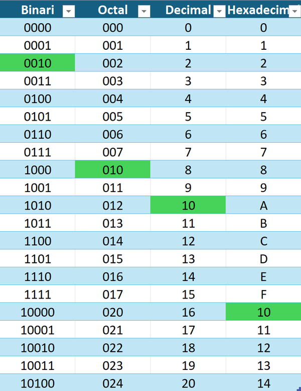
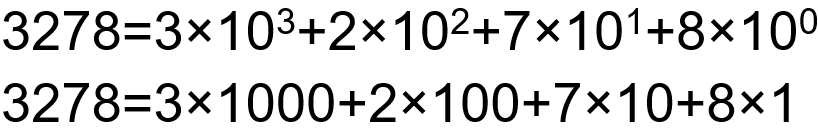
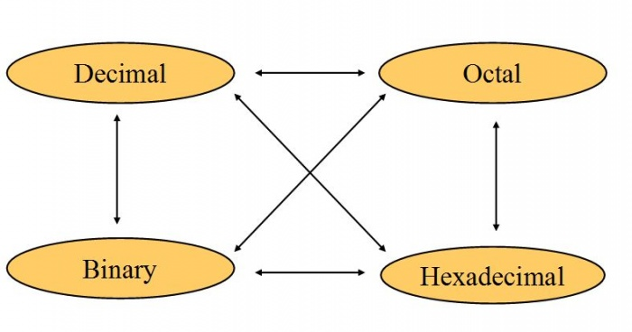
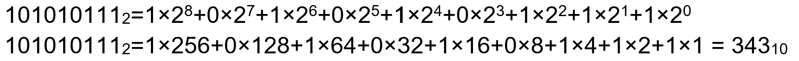

:::note[Connexió amb el currículum]
RA: 1 - CE: a, b, c, d
:::

## Què és la informàtica?
- La disciplina que estudia el tractament automàtic de la informació.

:::tip[FYI]
informàtica = **INFOR**mació auto**MÀTICA**
:::

## Parts d'un Sistema Informàtic
- Part física (hardware)
- Part lògica (software) 
- Personal i usuaris
- Documentació

## Representació de la informació

- El processador (el cervell de l'ordinador) interpreta les instruccions en binari (1s i 0s).

## Sistemes de representació
- Sistema binari (0,1)
- Sistema octal (0-7)
- Sistema decimal (0-9)
- Sistema hexadecimal (0-F) 

## Teorema fonamental de la numeració

### Binari a Decimal

### Decimal a Binari
45 en decimal a binari

- 45 ÷ 2 = 22, r = 1 
- 22 ÷ 2 = 11, r = 0 
- 11 ÷ 2 = 5, r = 1 
- 5 ÷ 2 = 2, r = 1 
- 2 ÷ 2 = 1, r = 0 
- 1 ÷ 2 = 0, r = 1

R = 101101

### Binari a Octal (i viceversa)

1274 octal a binari
> 1--------2--------7--------4

> 001-----010-----111-----100 

1274 octal = 1010111100 binari

1010111100 a un sistema octal

> 001 010 111 100

> 1 2 7 4 

1010111100 binari = 1274 octal

### Binari a Hexadecimal (i viceversa)

 **0010**1011**1100** binari = 2BC hexadecimal

### Hexadecimal a Octal (Intermedi)

### Hexadecimal/Octal a Decimal

Es realitza de la mateixa manera que de [binari a decimal](#binario-a-decimal) mitjançant el TFN, però amb base 8 o 16.

:::tip[FYI]
[Binary Code Game](https://learningcontent.cisco.com/games/binary/index.html)
:::
