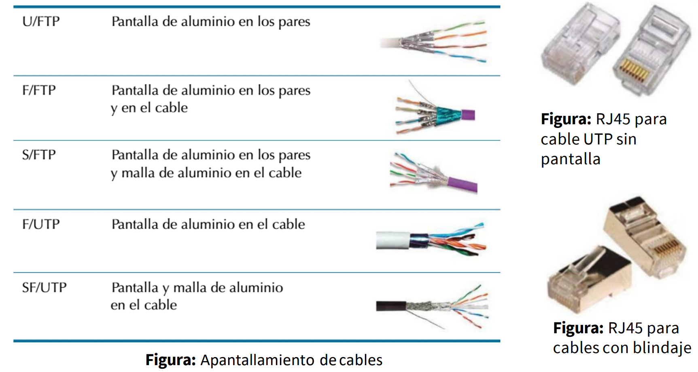

### **1. Components d'una xarxa informàtica**

1. **Dispositius d'interconnexió:**
   - **Switch**: Dispositiu de capa 2 que distribuïx els paquets de dades dins de la mateixa xarxa segons adreces MAC.  
   - **Router**: Opera en la capa 3 i connecta diferents xarxes, dirigint el trànsit entre elles mitjançant adreces IP.  
   - **Hub**: Funciona en la capa 1, retransmetent paquets a tots els dispositius connectats sense filtrar.  
   - **Bridge**: Connecta dos segments de xarxa i filtra el trànsit segons adreces MAC per a millorar el rendiment.  
   - **Patch Panel**: Panell de connexions que organitza i distribuïx cables de xarxa en instal·lacions estructurades. No processa dades, només facilita la connexió física.  
   - **Mòdem**: Convertix senyals digitals en analògiques (i viceversa) per a permetre la comunicació entre una xarxa local i un proveïdor d’Internet (ISP).  

2. **Servidors:**
   - Proporcionen serveis a la xarxa, com emmagatzematge, correu electrònic, bases de dades.
   - Exemples: Servidor web, servidor de fitxers.

3. **Clients:**
   - Dispositius que accedeixen als recursos proporcionats pels servidors.
   - Exemples: Ordinadors, telèfons mòbils, tauletes.

4. **Mitjans de transmissió:**
   - **Cablejat de coure (UTP, FTP, STP, SFTP):** Utilitzat en xarxes LAN.

   - **Fibra òptica (monomode, multimode):** Transmissió de dades a alta velocitat i llargues distàncies.
   - **Sense fils (Wi-Fi, Bluetooth, WiMAX):** Comunicacions sense cables per a LAN i MAN.

1. **Perifèrics de xarxa:**
   - Dispositius com impressores en xarxa, escàners i unitats d'emmagatzematge en xarxa (NAS).

---

### **2. Protocols de xarxa**

Els protocols defineixen com es comuniquen els dispositius en una xarxa.

1. **Protocols de capa de xarxa:**
   - **IP (Internet Protocol):** Adreçament i enrutament de dades.
   - **ICMP (Internet Control Message Protocol):** Informes d'errors i control de la xarxa.

2. **Protocols de capa de transport:**
   - **TCP (Transmission Control Protocol):** Protocol orientat a la connexió per a garantir l'entrega de dades.
   - **UDP (User Datagram Protocol):** Protocol sense connexió, més ràpid però sense garantia d'entrega.

3. **Protocols de capa d'aplicació:**
   - **HTTP (HyperText Transfer Protocol):** Transferència de pàgines web.
   - **FTP (File Transfer Protocol):** Transferència de fitxers.
   - **SMTP (Simple Mail Transfer Protocol):** Enviament de correu electrònic.
   - **DNS (Domain Name System):** Resolució de noms de domini a adreces IP.

4. **Protocols de seguretat:**
   - **WEP, WPA, WPA2, WPA3:** Protocols de xifrat per a protegir xarxes sense fils.

---

### **3. Mapes físics i lògics**

1. **Mapes físics:**
   - Representen la disposició dels dispositius i el cablejat físic de la xarxa.
   - Exemple: Un diagrama que mostra la ubicació dels ordinadors, servidors i cables en un edifici.

2. **Mapes lògics:**
   - Representen com es comuniquen els dispositius entre si, incloent subxarxes, adreces IP i ruteig.
   - Exemple: Un diagrama amb les adreces IP de cada dispositiu i rutes de trànsit configurades.

:::caution[activitat]
Practicum IV
:::