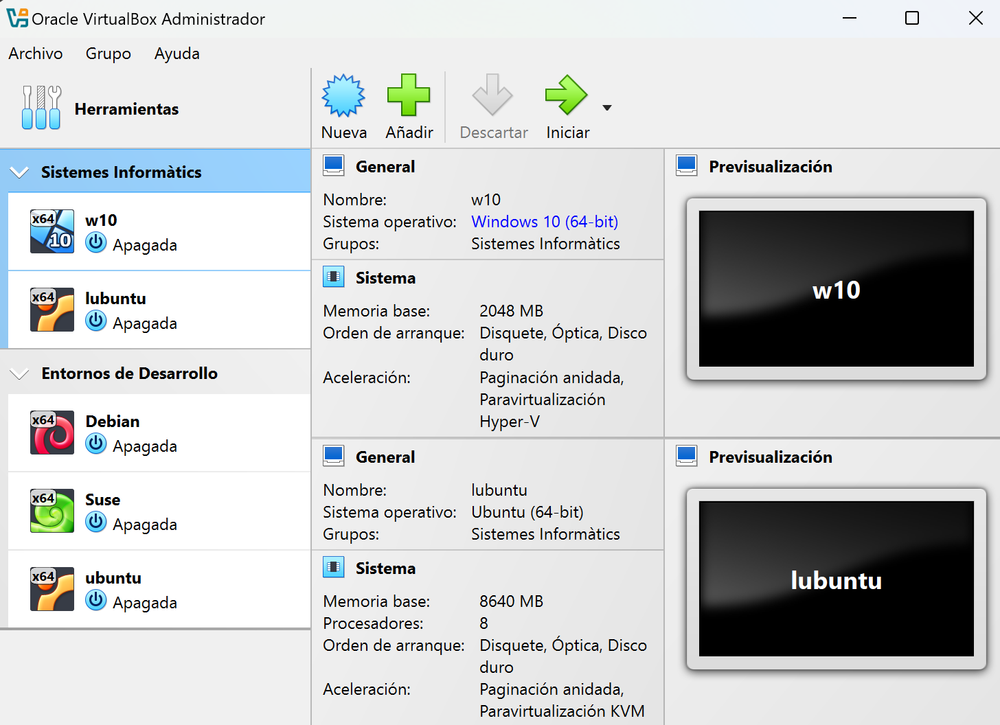

### 1. Guest Additions

**Guest Additions** és un conjunt de programes que milloren l'experiència d'usuari i l'eficiència de les màquines virtuals. Entre les millores que proporciona s'inclouen:

- **Suport per a pantalla completa**: Permet ajustar la resolució de la pantalla a la mida del monitor host.
- **Carpetes compartides**: Facilita l'intercanvi de fitxers entre el sistema host i el sistema guest.
- **Millora del rendiment gràfic**: Proporciona un controlador gràfic optimitzat per al sistema guest.
- **Funcionalitat "arrossegar i soltar"**: Permet moure fitxers entre el host i el guest simplement arrossegant-los.

### 2. Snapshots (instantànies)

Les **snapshots** permeten fer una captura de l'estat de la màquina virtual en un moment determinat. És una eina molt útil quan es fan canvis importants, com la instal·lació de nou programari o la configuració del sistema:

- **Restauració ràpida**: Permet tornar a un estat anterior si alguna cosa surt malament durant una instal·lació o prova.
- **Diverses snapshots**: Es poden crear diverses instantànies per a tenir diferents punts de restauració.

### 3. Suport per a USB

VirtualBox permet el **suport per a dispositius USB** connectats al host. Això significa que els dispositius USB poden ser reconeguts i utilitzats per les màquines virtuals:

- **USB 2.0 i USB 3.0**: Amb el paquet d'extensions instal·lat, és possible utilitzar dispositius USB d'alta velocitat.
- **Muntatge de dispositius automàtic**: VirtualBox pot muntar automàticament els dispositius USB connectats per facilitar el seu ús.

### 4. Mòdul de Xarxa Avançada

**VirtualBox** ofereix diverses opcions de configuració de la xarxa per a les màquines virtuals:

- **NAT**: Permet que el guest accedisca a internet a través del host.
- **Bridged Networking**: Fa que el sistema guest aparega com un dispositiu més de la xarxa local, permetent comunicació directa amb altres dispositius.
- **Internal Network**: Les màquines virtuals poden comunicar-se entre elles, però no amb la xarxa externa.
- **Host-Only Networking**: Només permet comunicació entre el host i les màquines virtuals, sense accés a la xarxa externa.

### 5. Carpetes Compartides

Les **carpetes compartides** permeten compartir directoris entre el sistema host i la màquina virtual. Això és molt útil per a transferir fitxers sense haver de fer ús de mitjans externs.

### 6. Remote Display Protocol (RDP)

VirtualBox proporciona un **servidor RDP** integrat, que permet accedir a la màquina virtual des de qualsevol dispositiu compatible amb el protocol **Remote Desktop**. Això és especialment útil per a treballar de manera remota:

- **Control remot complet**: Permet gestionar completament la màquina virtual des de qualsevol lloc.
- **Connexions multiusuari**: És possible que diversos usuaris es connecten a la mateixa màquina virtual, compartint recursos i tasques.

### 7. Exportació i Importació amb Format OVA

Les màquines virtuals creades amb VirtualBox poden ser **exportades** en un format **OVA** (Open Virtual Appliance), que és compatible amb altres solucions de virtualització. Això permet la portabilitat entre plataformes.

### 8. Cloud Integration

VirtualBox ofereix integració amb el núvol, permetent la **creació de màquines virtuals al núvol** i la connexió directa amb Oracle Cloud Infrastructure:

- **Migració fàcil**: Muntar una màquina virtual en el núvol per augmentar la disponibilitat i l'escalabilitat.
- **Backup remot**: Guardar còpies de seguretat de les màquines virtuals per assegurar-ne la integritat.

## Instal·lació de Guest Additions

Per a instal·lar **Guest Additions** en una màquina virtual:

1. **Iniciar la màquina virtual**.
2. Seleccionar **Dispositius > Inserir imatge de CD de les Guest Additions**.
3. Seguir les instruccions per a completar la instal·lació.
4. **Reiniciar** la màquina virtual després de la instal·lació.

## Creació i Administració de Grups 

**VirtualBox** permet organitzar màquines virtuals en **grups** per facilitar la seua administració, sobretot quan es gestionen múltiples màquines. Aquesta característica ajuda a realitzar accions comunes sobre diverses màquines al mateix temps.

### 1. **Creació de Grups**

Per a crear un grup en VirtualBox:
1. **Selecciona les màquines virtuals** que desitges agrupar, mantenint pressionada la tecla **Ctrl**.
2. **Clic dret** sobre qualsevol de les màquines seleccionades i tria l'opció **"Crear grup"**.

### 2. **Administració de Grups**

Una vegada les màquines estan agrupades, es poden realitzar diverses accions en elles de manera simultània:

- **Iniciar o Aturar**: Pots iniciar o aturar totes les màquines del grup amb un sol clic.
- **Eliminar Grup**: Selecciona el grup i fes clic dret per eliminar-lo.
- **Configurar Grup**: Pots modificar configuracions compartides per les màquines del grup.

:::caution[activitat]
A2.4 - Virtualbox Advanced
:::