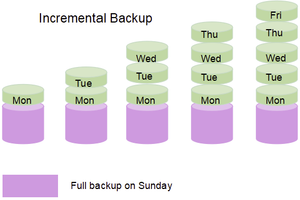

:::note[Connexió amb el currículum]
RA: 3 - CE: e, f, g
:::

## 1. Introducció a les Còpies de Seguretat
  Una còpia de seguretat és una còpia de les dades importants d'un sistema informàtic que es realitza amb l'objectiu de:
    
  - **Recuperació de dades** (en cas de pèrdua o dany)
  - **Continuïtat del negoci**
  - **Protecció contra ransomware**
    - El ransomware xifra les dades i exigeix un rescat per a la seua recuperació
  - **Compliment legal**
    - En alguns sectors, les empreses estan obligades per llei a realitzar còpies de seguretat de certes dades

### Tipus de còpies de seguretat
- **COMPLETA:** Copia la totalitat de les dades per això tarda menys temps en recuperar-les, per contra porta molt de temps realitzar una còpia de seguretat, depèn de la mida de dades a recolzar.
- **DIFERENCIAL:** El dilluns es fa una còpia de seguretat només dels arxius que han canviat des del diumenge, el dimarts es fa una còpia de seguretat només dels arxius que han canviat des del diumenge, i així successivament fins a la següent còpia de seguretat completa.
 

- **INCREMENTAL:** Les còpies de seguretat incrementals també fan una còpia de seguretat només de les dades modificades, però només de les dades que han canviat des de l'última còpia de seguretat, ja siga completa o incremental.
 

### Mètodes d'emmagatzematge
- Emmagatzematge local (discos durs externs, NAS).
- Emmagatzematge en el núvol (Google Drive, Dropbox, Amazon S3).

## Realització de Còpies de Seguretat
   - **Eines per a realitzar còpies de seguretat**:
     - **Windows Backup / historial d'arxius**: Eina nativa en sistemes Windows.
     - **Time Machine** (MacOS): Sistema de còpia de seguretat automàtic.
     - **Duplicati** i **Veeam Backup**: Programari de còpies de seguretat per a Windows, Linux i MacOS.
     - **rsync**: Comandament per a fer còpies de seguretat en Linux.

---

## 2. Planificació i Automatització de Tasques
   - La planificació de tasques és un procés que serveix per a organitzar i gestionar el temps de manera eficient. Consisteix a identificar i programar les tasques que s'han de realitzar

### Programació de tasques en el sistema operatiu

- **Windows**: El "**[Programador de tasques](../ut32-wintasks)**" permet automatitzar tasques com l'execució de programes, l'enviament de correus electrònics o la realització de còpies de seguretat.
- **Linux**: **Cron** és una eina que permet programar l'execució de comandaments o scripts en moments específics. Per a inici de sessió existeix l'automatització del propi sistema amb [aplicacions d'inici](../ut32-linuxtasks)
  
:::tip
[crontab guru](https://crontab.guru)
:::

### Scripts

- **Bash** (Linux): Permet automatitzar tasques en sistemes Linux, com la gestió d'arxius, la configuració del sistema o l'execució de programes.

- **PowerShell** (Windows): Similar a Bash, però per a Windows. Permet automatitzar tasques administratives i de gestió del sistema.

:::caution[Activitat]
Backups i automatització
:::