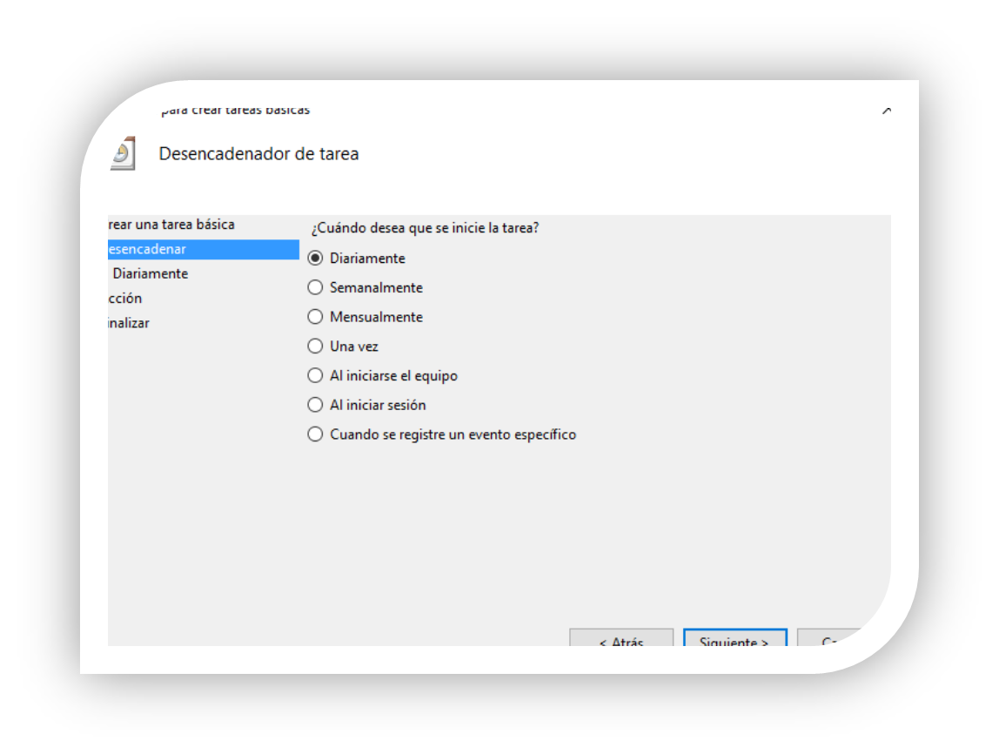

--- 
title: "Automatització Windows"
description: "Automatització Windows"
---

## Gestió de Tasques Programades en Windows

Una tasca programada és una acció que el sistema operatiu realitzarà en alguna de les següents circumstàncies:

- Quan arribe un moment determinat en el futur.
- Quan es produïsca un determinat esdeveniment.
- Amb una freqüència determinada.

D’aquesta manera, podrem planificar i programar aquelles accions que desitgem que es realitzen, evitant possibles oblits. Per a això, utilitzarem el programador de tasques. Per a accedir-hi entrarem en **Panell de control > Eines administratives > Programador de tasques** o també podem fer-ho mitjançant l’ordre `taskschd.msc`.

La manera més senzilla de programar una tasca és fer clic en **Crear tasca bàsica** (situat en el menú d’accions a la dreta). A continuació, apareixerà un assistent que ens ajudarà a crear la tasca planificada.

Indicarem quan o degut a què volem que s’execute la tasca. En aquesta pantalla, seleccionarem una de les opcions depenent de com o quan volem que s’execute la tasca (diàriament, setmanalment, mensualment, una vegada, inici de sessió, final de sessió o vinculat a un esdeveniment particular).

Per exemple, establirem que la tasca s’execute diàriament a una hora determinada.

A continuació, indicarem la **acció a realitzar**. En aquest cas, podrem indicar l’execució d’un programa, enviar un correu electrònic, mostrar un missatge, etc.

Com a exemple, crearem una tasca senzilla: obrir la calculadora de Windows a una hora determinada tots els dies.  
  

Accedint a la tasca creada podem modificar-la i afegir accions o condicions. També és possible consultar les execucions (o intents fallits) de cada tasca. Per a això, primer hem d’habilitar l’opció d’historial (en Windows 11).

Les opcions que es troben en les pestanyes **General**, **Desencadenadors**, **Accions**, **Condicions** i **Configuració** es poden configurar directament si creem una tasca des de l’opció **Crear Tasca** (no utilitzant "Crear tasca bàsica").  

- En la pestanya **General**, podem modificar la descripció de la tasca i establir les opcions de seguretat adequades.
- En la pestanya **Desencadenadors**, podem veure i modificar les dades relatives als criteris que s’han de complir per a iniciar l’execució de la tasca.  

  
- La següent pestanya conté les **accions** associades a la tasca programada. Si n’hi haguera més d’una, s’executarien en ordre seqüencial.  

  
- En la pestanya **Condicions**, s’indiquen els criteris que s’han de complir perquè el desencadenador s’active (per exemple, que l’equip estiga connectat a corrent altern).  

  
- En la pestanya **Configuració**, s’indiquen algunes qüestions complementàries sobre com ha de comportar-se el sistema en relació amb la tasca (per exemple, que la tasca es detinga si s’executa durant més de 3 dies).  
