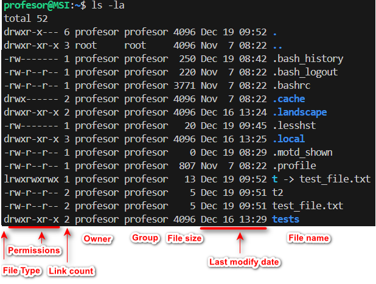

## Conceptes bàsics
:::tip[WSL]
> **/home/USUARIO-LINUX/** # Carpeta personal en Linux
>
> **/mnt/c/Users/USUARIO-HOST/** # Carpeta personal en HOST (Windows)
:::

### Prompt de Linux

- El **prompt** mostra informació útil com l'usuari, la màquina i el directori actual.
  - Exemple: `antonio@ubuntu:~$`
  - `$`: Usuari sense privilegis.
  - `#`: Usuari amb privilegis root.

### **Ordres i Entrada/Eixida Estàndard**

1. Les ordres en Linux són **paraules reservades** utilitzades pel sistema operatiu per executar programes a través d'un terminal o línia de comandes.

   - **Sintaxi general:**
     ``` frame="none"
     ordre [-opcions] argument1 argument2
     ```
   - **Agrupació d'opcions:**
     ``` frame="none"
     ls -l -a = ls -la
     ```


2. **Diferenciació entre majúscules i minúscules:**
   En Linux, **les majúscules i minúscules són diferents**, per la qual cosa has de parar atenció en escriure les ordres.

### **Entrada i Eixida Estàndard en Linux**

Tot programa en Linux treballa amb tres tipus de fluxos principals:

- **Entrada estàndard** (stdin): Teclat.
- **Eixida estàndard** (stdout): Pantalla.
- **Eixida d'error** (stderr): Pantalla.

### Redirecció, concatenació i ajuda

- `>` i `>>`: Redirigeixen l'eixida a un fitxer.
  - Exemple: `ls -a > fitxer.txt`
- `<`: Redirigeix l'entrada des d'un fitxer.
  - Exemple: `wc < fitxer.txt`
- **Tubs**: Permeten que l'eixida d'una ordre es convertisca en l'entrada d'una altra.
  - ordre1 \| ordre2 \| ordre3  
  - Exemple: `cat /etc/passwd \| wc -l`

- **Concatenació**: Executa ordres de manera seqüencial sense relació:  
  - ordre1 && ordre2 && ordreN  
  - Exemple: `cat /etc/passwd && cat /etc/group`
- **Ajuda sobre Ordres**
  - **man**: Mostra una pàgina d'ajuda completa.  
    - `man pwd`  
  - **help**: Proporciona ajuda ràpida.  
    - `pwd --help`  

## **Ordres**

### **Ordres Bàsiques**

| **Ordre**   | **Descripció**                                     | **Exemple**                     |
|-------------|----------------------------------------------------|----------------------------------|
| **pwd**     | mostra la ruta actual.                            | `pwd`                           |
| **cd**      | canvia de directori.                              | `cd /home/usuari`               |
| **ls**      | llista fitxers.                                   | `ls -l`                         |
| **mkdir**   | crea directoris.                                  | `mkdir nova_carpeta`            |
| **rm**      | esborra fitxers o directoris.                     | `rm fitxer.txt`                 |
| **mv**      | mou fitxers o directoris.                         | `mv fitxer.txt carpeta/`        |
| **cp**      | copia fitxers o directoris.                       | `cp fitxer.txt copia.txt`       |
| **uname**   | mostra informació del sistema.                    | `uname -a`                      |
| **shutdown**| apaga o reinicia l'equip.                         | `shutdown now` o `shutdown -r`  |
| **clear**   | neteja la pantalla del terminal.                  | `clear`                         |
| **date**    | mostra la data i hora del sistema.                | `date`                          |
| **cal**     | mostra el calendari del mes o any indicat.        | `cal 2024`                      |
| **who**     | mostra qui està connectat al sistema.             | `who`                           |

:::caution[Activitat]
- Estructura de directoris en Linux
:::

### Wildcards (Comodins)

Les **wildcards o comodins** són caràcters especials.
En una baralla de cartes, un comodí és una carta especial que pot representar qualsevol altra carta.
De manera similar, en informàtica, una wildcard és un caràcter especial que pot substituir qualsevol altre caràcter.

1. **Asterisc (*)**: Representa zero o més caràcters. És útil per a buscar fitxers que coincidisquen amb un patró específic.
   ```bash
   ls *.txt  # Llista tots els fitxers que acaben en .txt
   ```

2. **Signe d'interrogació (?)**: Representa un sol caràcter. És útil quan es busca un fitxer amb un nom específic però amb un caràcter variable.
   ```bash
   ls file?.txt  # Llista fitxers com file1.txt, file2.txt, etc.
   ```

3. **Claudàtors ([ ])**: Representen un rang de caràcters. S'utilitza per a buscar fitxers que continguen qualsevol dels caràcters especificats dins dels claudàtors.
   ```bash
   ls file[1-3].txt  # Llista fitxers com file1.txt, file2.txt, file3.txt
   ```

4. **Negació ([! ])**: Representa qualsevol caràcter que no estiga dins dels claudàtors.
   ```bash
   ls file[!1-3].txt  # Llista fitxers que no siguen file1.txt, file2.txt, file3.txt
   ```

5. **Rangs de caràcters**: Pots especificar rangs de caràcters dins dels claudàtors.
   ```bash
   ls file[a-c].txt  # Llista fitxers com filea.txt, fileb.txt, filec.txt
   ```

### **Ordres Avançades**

| **Ordre**   | **Descripció**                          | **Exemple**                 |
|-------------|-----------------------------------------|-----------------------------|
| **grep**    | busca patrons en fitxers.              | `grep root /etc/passwd`     |
| **sort**    | ordena les línies d'un fitxer.         | `sort -f /etc/passwd`       |
| **wc**      | compta línies, paraules o caràcters.   | `wc /etc/passwd`            |
| **cut**     | extrau seccions específiques.          | `cut -d':' -f1 /etc/passwd` |
| **uniq**    | elimina o mostra línies duplicades.    | `sort /etc/passwd \| uniq`  |
| **find**    | busca fitxers i directoris.            | `find /home -name "*.txt"`  |
| **xargs**   | construeix i executa ordres.           | `find . -name "*.txt" \| xargs rm` |
| **head**    | mostra les primeres línies.            | `head -n 10 /etc/passwd`    |
| **tail**    | mostra les últimes línies.             | `tail -f /var/log/syslog`   |
| **tee**     | divideix l'eixida i la guarda en un fitxer. | `ls \| tee llista.txt` |
| **tr**      | tradueix o elimina caràcters.          | `echo "linux" \| tr 'a-z' 'A-Z'` |
| **sed**     | edita text en línia.                   | `sed 's/root/admin/g' /etc/passwd` |
| **tar**     | comprimeix o descomprimeix fitxers.    | `tar -czvf fitxer.tar.gz carpeta/` |

:::tip[TAR]
[tar](https://www.hostinger.es/tutoriales/como-usar-comando-tar-linux)
:::


### **Ordres de Gestió**

| **Ordre**  | **Descripció**                           | **Exemple**                   |
|------------|------------------------------------------|-------------------------------|
| **chmod**  | canvia els permisos de fitxers.         | `chmod 755 script.sh`         |
| **chown**  | canvia el propietari d'un fitxer.       | `chown usuari:grup fitxer.txt`|
| **scp**    | copia fitxers entre màquines.           | `scp fitxer.txt usuari@192.168.1.100:/home/usuari/` |
| **rsync**  | sincronitza fitxers i directoris.       | `rsync -av carpeta/ usuari@192.168.1.100:/destí/` |
| **df**     | mostra l'espai al disc.                 | `df -h`                       |
| **du**     | calcula la mida de fitxers.             | `du -sh /home/usuari/`        |
| **ps**     | llista els processos actius.            | `ps aux \| grep apache`       |
| **top**    | mostra processos en temps real.         | `top`                         |
| **kill**   | finalitza processos usant el PID.       | `kill 1234`                   |
| **mount**   | munta particions i volums.                        | `mount /dev/sda1 /mnt`          |
| **umount**  | desmunta particions i volums.                     | `umount /mnt`                   |
| **fdisk**   | administra particions del disc.                   | `fdisk /dev/sda`                |
| **ln**      | crea enllaços físics i simbòlics.                 | `ln -s fitxer_original enllaç`  |

:::tip[Prova]
1. Què fa l'ordre `uname -a`?
2. Prova les ordres següents:
   - `cat /etc/passwd \| wc -l`
   - `ls -l \| sort -k 5n`

 [Cheatshet - Terminal](https://terminaldelinux.com/terminal/cheatsheets/#chuleta-de-la-terminal-en-formato-pdf-gratis)
:::