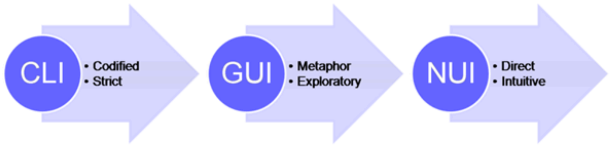
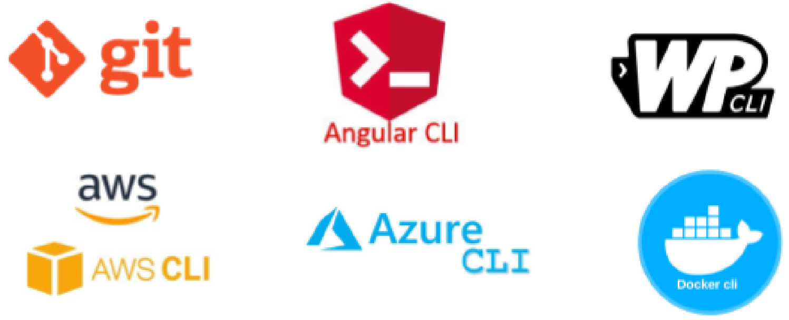

Les Interfícies de Línia de Comandes (CLI), també conegudes com a interfícies basades en text o consoles, permeten als usuaris interactuar amb un sistema informàtic a través de comandes de text. Aquestes comandes s'introdueixen típicament a través d'una terminal o un símbol del sistema.

Les interfícies CLI poden semblar arcaïques en l'era de les elegants interfícies gràfiques d'usuari (GUI) i les emergents tecnologies d'interfícies naturals d'usuari (NUI), però continuen sent eines indispensables per als usuaris avançats i professionals que busquen un control i una eficiència incomparables.

Les interfícies CLI continuen sent una eina fonamental en la informàtica, especialment per a tasques que requereixen un control precís i automatització.

## Pros i Contres de CLI
- **Pros:**
  - Bo per a fer coses repetitives i automatitzar-les.
  - No consumeix molta potència de l'ordinador.
  - Ofereix un control exacte sobre com es configura el sistema.
  - Necessari per a servidors on l'accés remot és comú i utilitzar una GUI podria no funcionar bé.
- **Contres:**
  - Més difícil d'aprendre per als nous usuaris.
  - Cal escriure comandes, cosa que pot semblar més difícil que fer clic en coses.
  - No mostra tanta informació a la pantalla com les GUI.
  - Les comandes poden ser complexes a vegades, cosa que pot portar a errors si no s'escriuen correctament.

:::tip
Manz.dev desenvolupador que destaca el terminal
:::