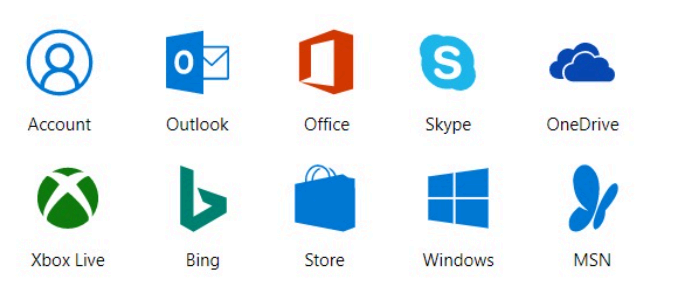
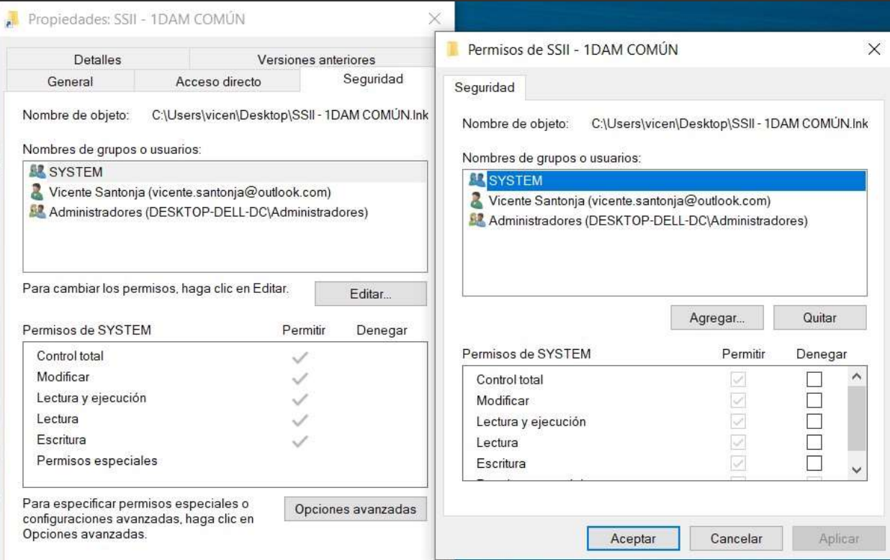
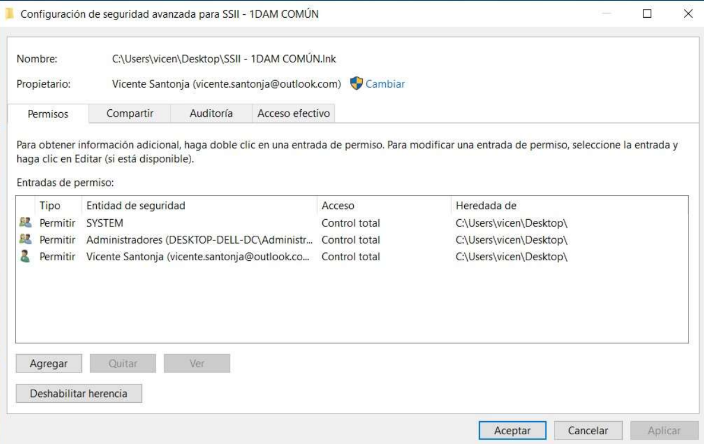

## 1. Usuaris, grups i permisos en Windows

Abans de treballar amb un dispositiu amb Windows 10, has d'iniciar sessió amb un **compte autoritzat**. Els comptes d'usuari són essencials per a la seguretat de Windows i per oferir una experiència personalitzada.

### Tipus de comptes en Windows 10

1. **Compte de Microsoft**  
   - Proporciona autenticació i sincronització entre dispositius.
   - Es pot usar un correu de qualsevol proveïdor per crear-la.

2. **Compte local**  
   - Credencials i dades emmagatzemades a l'equip.
   - No requereix un correu electrònic.

3. **Compte d'Azure Active Directory**  
   - Per a empreses i centres educatius.
   - Ofereix autenticació multifactor i accés a serveis en línia.

4. **Compte de domini d'Active Directory**  
   - Per a organitzacions amb dominis Windows.
   - Requereix Windows 10 Pro, Enterprise o Education.

### Gestió de comptes

- Usa **Configuració > Comptes** per administrar comptes.
- També pots usar el **Panell de control clàssic**.

### Comptes locals predeterminats
- **Administrador:** no es pot eliminar i està deshabilitada per defecte.
- **Convidat:** permet accessos temporals, però està deshabilitat per defecte.

### Gestió de grups locals

Un grup és una col·lecció de comptes que pots administrar com una unitat. Els grups simplifiquen l'administració de permisos en recursos.

### Grups predeterminats en Windows 10
- **Administradors:** tenen control total sobre el sistema.
- **Usuaris:** comptes estàndard amb accés limitat.

Pots gestionar els grups locals des de la **Consola d'administració d'equips**.

:::caution[activitat]
Gestió d'usuaris i grups
:::

## 2. Gestió de permisos d'arxius i carpetes

Els permisos són essencials per autoritzar usuaris a accedir a recursos en un equip. 

### Tipus de permisos
- **Explícits:** configurats en crear un recurs o mitjançant acció de l'usuari.
- **Heredats:** propagats des del contenidor del recurs.

### Atorgar i denegar permisos
- Els propietaris poden concedir permisos a usuaris o grups.
- Els permisos no concedits explícitament es deneguen implícitament.

Evita l'ús de denegacions explícites, ja que augmenta la complexitat i pot causar errors.

#### Opcions Avançades

:::caution[activitat]
Gestió de permisos d'arxius i carpetes
:::