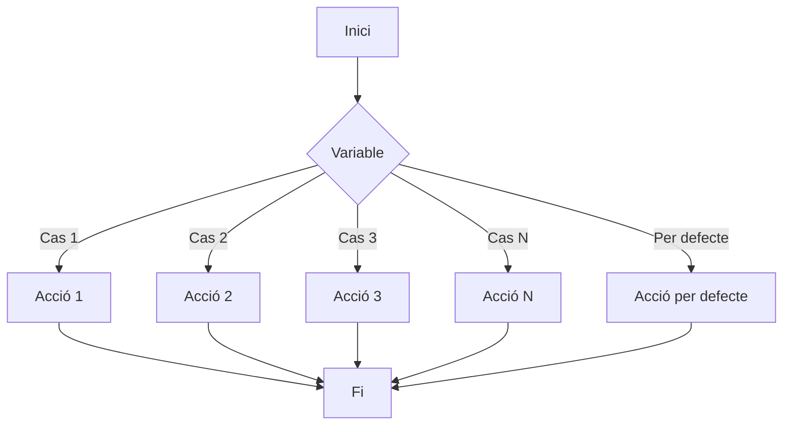

La instrucció **case** equival a una estructura de if/else anidada. Comprovem el valor de la condició i en funció d'eixe valor fem una cosa o una altra. (S'utilitza sobretot per a fer menús.)



```bash
#!/bin/bash
case $var in
valor-1)
  instruccions;;  
valor-2)
  instruccions;;
…  
valor-n)
  instruccions;;
*)
  instruccions;;
esac
```
:::note[Aclaracions]
- Cada opció ha d'acabar amb parèntesi ")".
- L'última instrucció de cada opció es termina amb ;; per a indicar que ha acabat.
- Amb el metacaràcter "*" aconseguim que coincidisca qualsevol cosa, per la qual cosa sempre es complirà la condició. El * equival a l'"else" del "if". Si no es prem cap opció correcta, llavors s'executa el *.
- S'ha d'usar "esac" per a finalitzar l'estructura.
- Si les opcions que posem són lletres, les hem de posar entre cometes "A")
:::

### Exemple 1

```bash
#!/bin/bash
echo "1. Eliminar fitxer"
echo "2. Copiar fitxer"
echo "3. Exit"
read –p "selecciona una opció" opc
case $opc in
1)
  echo "fitxer eliminat";;
2)
  echo "fitxer copiat";;
3)
  echo "adéu";; 
*)
  echo "eixa opció no és correcta, adéu";;
esac
```

### Exemple 2 - Avançat

```bash
#!/bin/bash
case $nom in
"pepito")
  echo "Hola pepito";;
"Salva")
  echo "Hola Salva";;
"alberto" | "pepe")
  echo "el teu nom és $nom"
  echo "Benvingut";;&
[aA]*)
  echo "El teu nom comença per A";;
*)
  echo "Qui eres tu?"
  echo "adéu";;
esac
```
:::note[Aclaracions]
- Podem fer ús de | per a integrar dues opcions possibles, tant si marques una com l'altra s'executaran les mateixes instruccions.
- Podem executar diverses ordres en cada opció. Els ;; només es posaran al final de l'última instrucció d'eixa opció.
- Amb l'ús de “;;&” estem indicant que continue comprovant la resta d'opcions.
:::

