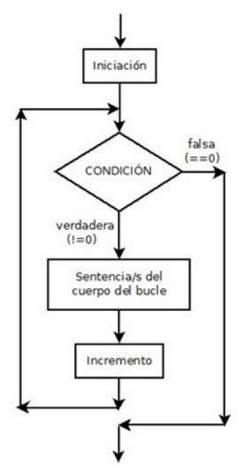

Un bucle **for** en bash és una estructura de control (de repetició) que permet executar un conjunt de comandaments repetidament per a cada element en una llista o un rang de valors.


```bash
#!/bin/bash
for (( inicialització; condició; increment ))  
do
  instruccions
done
```

### Exemple 1

```bash
#!/bin/bash
IFS=$'\n'
#càlcul de nº de línies
lineas=`wc -l nombres | cut -d ' ' -f 1`
for ((x=1;x<=$lineas;x++))
do
  echo $x
  linea=`head -n$x nombres | tail -n 1` 
  nombre=`echo $linea | cut -d ' ' -f 1`
  adduser $nombre
  echo "$nombre afegit com a usuari" 
done
```