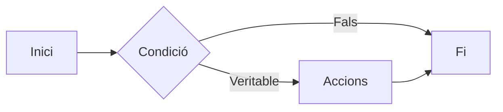
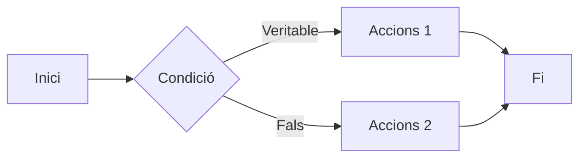
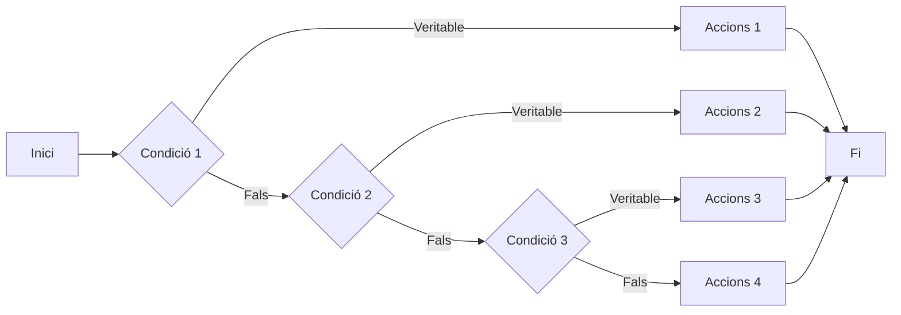

L'**if** és una estructura condicional en programació que permet executar un bloc de codi només si es compleix una condició específica.

```js
if [[ condició ]]
then
  accions
fi
```

- **if** obri l'estructura i **fi** la tanca
- [[ condició ]] 
  - veritable → execute “accions” 
  - fals → no execute res
- [[ expressió ]] → Permet l'ús d'expressions regulars, no cal entrecomillar les variables, ni escapar caràcters especials.



:::note[Coses a tindre en compte]
- Cal deixar un espai en blanc entre els claudàtors.
- Podem fer condicions usant variables, fent ús del $, ja que volem comparar el seu contingut.
- És recomanable tabular les accions perquè el codi quede més net.
- Sempre ha de finalitzar l'estructura amb fi.
:::

## IF/ELSE
Podem crear condicions amb alternatives, on si no es compleix una condició es realitza una altra llista d'accions:

```js
if [[ condició ]]
then
  accions 1
else
  accions 2
fi
```



> La secció **else** és opcional

## Nidar
Es poden niar moltes condicions diferents amb l'element **elif**:

```js
if [ condició ]
then
    accions 1
elif [ condició ]
then
    accions 2
elif [ condició ]
then
    accions 3
else
    accions 4
fi
```


