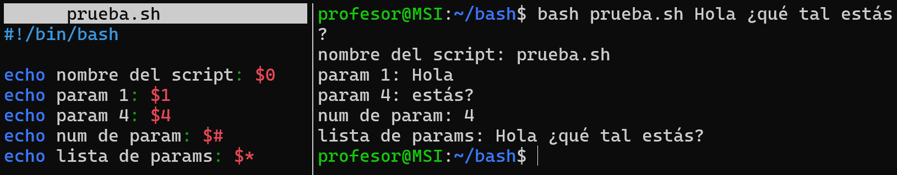

### Pas de paràmetres

Un argument és un paràmetre que se li passa a una funció o a un programa. És a dir, són variables d'entrada. Pot haver-hi més d'un o cap.

```js
./miscript.sh arg1 arg2 arg3 … argn
```
```js
./sócUnScript.sh 1 hola 2 adéu açò és un argument abc 100
```
| **Argument** | **Descripció**                | **Resultat**                          |
|--------------|-------------------------------|---------------------------------------|
| $1           | Argument nº1                  | 1                                     |
| $2           | Argument nº2                  | hola                                  |
| $3           | Argument nº3                  | 2                                     |
| $4           | Argument nº4                  | adéu                                  |
| $5           | Argument nº5                  | açò                                   |
| ${10}        | Argument nº10                 | 100                                   |
| $0           | És el nom del script          | sócUnScript.sh                        |
| $* o $@      | Una llista amb tots els arguments | 1 hola 2 adéu açò és un argument abc 100 |
| $#           | Nombre d'arguments            | 10                                    |
  
  > Els arguments van separats per espais i en cas d'inserir un metacaràcter, com *, és necessari escapar-lo → `./sócUnScript.sh \*`

  