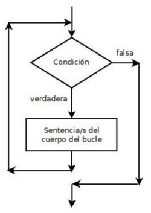

Un bucle **While** en bash és una estructura de control (de repetició). _Les instruccions s'executaran mentre es complisca l'expressió._


```bash
#!/bin/bash
while [ expressió ]
do
  instruccions
done
```

### Exemple 1 - Bucle infinit

```bash
#!/bin/bash
while [ true ] 
do
  echo "BUCLE INFINIT"
done
```

### Exemple 2

```bash
#!/bin/bash
read -p "Introdueix un número: " num
while [ $num -ne 0 ]
do
  echo "El número elegit no és 0" 
  read -p "Introdueix un número: " num
done
```