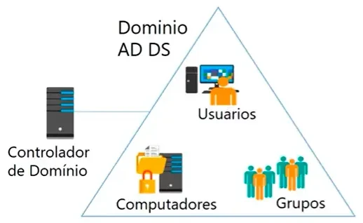

## Serveis de directori (Directory Services)

Els serveis de directori **emmagatzemen informació** sobre l'organització, llocs, ordinadors, usuaris, objectes compartits i qualsevol altra cosa que puga formar part de la infraestructura de xarxa. Els **elements** del directori actiu poden ser diferents entre si (**usuaris, grups, polítiques d'accés, permisos, etc.**), per la qual cosa la informació emmagatzemada variarà segons la naturalesa de l'objecte. Tota aquesta informació s'emmagatzema en una **base de dades jeràrquica**.

### Elements
  - **Directori**: és un repositori únic per a la informació relativa als usuaris i recursos d'una organització (objectes).
  - **Domini**: col·lecció d'objectes dins d'un directori que forma un subconjunt administratiu. Per a assignar noms als dominis s'utilitza el protocol DNS, per la qual cosa és necessari almenys un servidor DNS instal·lat en la xarxa.
  - **Objecte**: Qualsevol dels components que formen part del directori. Poden ser recursos, usuaris, relacions de confiança, servidors, equips, unitats organitzatives, etc.  
    En general, els objectes s'organitzen en tres categories:
    - **Usuaris**: identificats a través del binomi nom/contrasenya i que es poden organitzar en grups.
    - **Recursos**: elements als quals els usuaris poden accedir segons els seus privilegis per a desenvolupar la seua activitat. Poden ser carpetes compartides, impressores, etc.
    - **Serveis**: funcions a les quals els usuaris tenen accés, com el correu electrònic, connexió a Internet o còpies de seguretat al núvol.
  - **Unitat Organitzativa**: és un contenidor d'objectes que permet organitzar-los en subconjunts de forma jeràrquica. D'aquesta manera, podem establir una estructura lògica que represente adequadament la nostra organització i en facilite l'administració.
  - **Grups**: conjunt d'objectes d'usuari. Igual que les unitats organitzatives, faciliten l'organització i administració dels objectes, en aquest cas concret, usuaris.
  - **Controlador de domini**: és l'equip que conté la base de dades d'objectes del directori per a un determinat domini, inclosa la informació de seguretat. A més, serà responsable de l'autenticació d'objectes dins del seu àmbit de control.

## DNS (Domain Name Server)

Per a assignar noms a tots aquests objectes que componen la xarxa, els serveis de directori defineixen un **espai de noms unívoc**, i identifiquen cadascun d'aquests objectes amb un nom únic en tot el directori.

La tecnologia utilitzada per a crear aquest espai de noms és el DNS (**Domain Name Server**), i el seu funcionament és similar al d'Internet. Cadascun dels objectes del directori posseeix un **DN (Distinguished Name)** que el identifica de manera unívoca respecte a la resta d'elements del directori.

Un altre aspecte important dels serveis de directori és que ofereixen una **capa d'abstracció** per a facilitar l'accés als objectes. S'ha d'indicar una **única ubicació** on es dirigiran les peticions d'informació. No importa si la informació sol·licitada es troba o no en eixe emplaçament, el **servei de directori s'encarregarà de gestionar les sol·licituds** que li arriben.

  :::danger[aclariment]
  **Active Directory** és un tipus específic de servei de directori. Mentre que el servei de directori és un concepte ampli que abasta qualsevol sistema que gestione informació de xarxa, Active Directory és una implementació concreta d'aquest concepte, dissenyada per Microsoft per als seus entorns de xarxa.
  :::